# OpenGate — Database Schema Document

**Version:** 1.3
**Status:** Draft for review
**Document type:** Concrete schema specification (tables, columns, constraints, indexes, RLS policies, migration structure)
**Author:** Jelena Marjanović
**Date:** May 2026
**Predecessor documents:** opengate-prd-v1.md, opengate-pfd-v1.md, opengate-system-architecture-v1.md, opengate-system-design-v1.md
**Successor document:** opengate-implementation-plan-v1.md (to be produced after this document is accepted)

---

## 1. How to read this document

This document is the fifth and most concrete layer in the OpenGate documentation set, and the last document before the implementation plan that decomposes the work into user stories. The four documents above this one specified what the system must be, what its functional capabilities are, what components realize those capabilities, and what implementation patterns govern those components. The present document specifies the exact PostgreSQL schema that the components persist their state into. Where the System Design document said "the audit log read model is denormalized with member and door names joined into the row to support efficient compliance queries", the present document specifies the `audit_log_view` table with its columns, types, constraints, indexes, and the RLS policy that scopes its rows to the requesting tenant.

The reader should understand from the outset that this document is intentionally concrete in a way that the previous documents were not. SQL DDL appears throughout. Indexes are specified with their exact column ordering. RLS policies are written in their final form. The migration sequence is laid out file by file. The reason for this concreteness is that the database schema is the most stable artifact in the entire system: code can be rewritten, components can be swapped, but a database schema in production carries data that must be migrated forward forever, and every column added or removed is a permanent commitment. The cost of getting the schema wrong is higher than the cost of getting any other layer wrong, and the document accordingly pays the price of being explicit upfront.

The structure of the document follows the natural grouping of tables by domain area. After the conventions section that establishes the rules every table follows, and the migration tooling section that explains how the SQL is delivered to the database, the schema is presented in groups that correspond approximately to the capability areas from the Product Feature Document: identity and authentication, the event store, idempotency caches, the read model tables organized by the aggregate they serve, the subscription tables, the export tables, and the reader connectivity tables. Each group section presents the tables in that group with their full DDL, followed by a discussion of design decisions specific to those tables. After the table groups, three cross-cutting sections cover the RLS policies that apply uniformly across the tenant-scoped tables, the index strategy that supports the system's query patterns, and the retention policy implementation that bounds storage growth.

The conventions established in section two of this document are normative. A table that does not follow the conventions is a bug in the schema unless its deviation is explicitly justified in the section that introduces it. A reader spotting an inconsistency between the conventions and a later section should treat the inconsistency as a documentation defect to be reported and fixed.

The audience for this document is the engineer who will write the migration files and the SQL queries that the `sqlc` tool will compile into Go functions. The author herself is the immediate audience; any reviewer who later wants to verify that the implementation matches the design is the secondary audience. The document does not assume that the reader is fluent in every advanced PostgreSQL feature it uses; mechanisms such as Row-Level Security, advisory locks, trigram indexes, and `set_config` for session variables are explained briefly at the points where they appear, with references to the PostgreSQL documentation for full detail.

---

## 2. Schema conventions

A small set of conventions governs every table in the OpenGate schema. The conventions exist so that the schema reads consistently from one section to the next, so that mistakes such as a forgotten constraint or a wrong type are easier to spot, and so that future contributors do not have to relearn the project's stylistic decisions. The conventions are themselves uncontroversial; they are the rules that mature Postgres projects converge on, adapted slightly to OpenGate's specific needs.

**Naming.** All identifiers in the schema use `snake_case`, which is the PostgreSQL idiom and which avoids the case-folding problems that occur with mixed-case identifiers. Table names are plural nouns describing what the table holds: `tenants`, `users`, `sessions`, `events`, `subscriptions`. Read model tables, which represent denormalized projections of event-sourced state, carry the suffix `_view` to distinguish them from the underlying event store and from the tables that hold authoritative state: `members_view`, `credentials_view`, `policies_view`, `audit_log_view`. Junction tables that materialize many-to-many relationships within read models follow the same pattern: `policy_assignments_view`, `policy_doors_view`. Column names are singular nouns or short noun phrases: `name`, `email`, `tenant_id`, `last_seen_at`. Foreign key columns end with `_id` and reference the column they point to (typically the `id` of the parent table). Timestamp columns end with `_at` and are always `timestamptz` storing UTC moments. Boolean columns are named so that the affirmative case is the meaningful one: `is_offline_reconciled` rather than `is_online`.

**Data types.** Identifiers are `uuid`. The application generates UUIDv7 values, which are time-ordered UUIDs introduced in the IETF draft that became RFC 9562 in 2024; the time-ordering property gives the primary-key index favorable insertion locality, since rows committed close in time have identifiers that sort close together. UUIDv7 is generated in the application rather than in the database because event-sourced aggregates require the identifier to be known before the aggregate is persisted, and because moving the generation to the application keeps the database free of dependencies on extensions or custom functions for UUIDv7. Textual data is `text` rather than `varchar(n)` because PostgreSQL does not benefit from length-bounded varchar columns and the `text` type permits future flexibility. JSON data is `jsonb` rather than `json`; the `jsonb` type stores a binary representation that supports efficient indexing, equality lookups, and containment queries, none of which the textual `json` type supports. Timestamps are `timestamptz`, which stores the value as UTC internally and presents it in the connection's configured timezone on read; the application code always reads and writes UTC and converts to the tenant's local timezone only at the display layer. Durations are `interval`. Network addresses are `inet`. Binary data such as response bodies in idempotency caches and signature bytes in export records are `bytea`. Enumerations are represented as `text` columns with `CHECK` constraints listing the allowed values, rather than as PostgreSQL native enum types; the choice favors flexibility because adding a new enum value to a native type requires an `ALTER TYPE` migration with operational considerations that are heavier than adjusting a `CHECK` constraint.

**Primary keys.** Every table has a single-column primary key named `id` of type `uuid`, with the exception of junction tables that use composite primary keys on their foreign-key columns. The `id` columns are not auto-generated by the database; they are inserted by the application code, which generates a UUIDv7 immediately before the insert. The schema does not declare a `DEFAULT` clause on the `id` column because no default would correctly produce a UUIDv7 without a custom function; relying on the application to populate the value is therefore both necessary and explicit.

**Foreign keys.** Foreign keys are declared with explicit `REFERENCES table(column)` clauses. The default `ON DELETE` behavior is `NO ACTION`, which causes a delete that would orphan referencing rows to fail with an error; the application code is expected to handle the cascading manually because the domain logic for cascading is not always a simple delete (a deleted member, for example, retains their identity in the audit log indefinitely). The few tables where cascading is the correct semantic explicitly declare `ON DELETE CASCADE`, and those cases are called out in the table's narrative.

**Timestamps.** Every table that represents an entity (rather than a join or a cache) carries a `created_at` column with `DEFAULT now()` and an `updated_at` column with `DEFAULT now()`. The `created_at` column is never updated after the initial insert. The `updated_at` column is updated by application code on every mutation; the schema does not use a database trigger to maintain it because the application-level discipline is preferred (a trigger introduces hidden behavior that complicates debugging). Tables that represent immutable records, such as the `events` table, omit `updated_at`.

**Tenant scoping.** Every tenant-scoped table carries a `tenant_id uuid NOT NULL` column referencing the `tenants` table. The column is present on every row including rows in junction tables, and the column participates in the RLS policy described in section thirteen of this document. The column is denormalized into junction tables (even though it could be derived through the foreign key) because the RLS policy and the indexes both benefit from the column being present directly on the table being queried. Tables that are global to the deployment, such as `casbin_rules` and the River-managed tables, do not carry a `tenant_id`.

**Constraint naming.** Constraints are explicitly named with a stable scheme: `<table>_<column>_<kind>` for single-column constraints (`users_email_check`), `<table>_<descriptor>_<kind>` for multi-column constraints (`policy_assignments_per_member_unique`). The explicit naming is important for migrations: an unnamed constraint receives a system-assigned name that can change between PostgreSQL versions or between environments, making subsequent migrations that reference the constraint fragile. The naming convention `<table>_<column>_<kind>` is the most readable variant and is what `sqlc` and other tooling expect.

**The `now()` function and time consistency.** All `DEFAULT now()` clauses use the PostgreSQL `now()` function, which returns the timestamp at the start of the current transaction. Within a single transaction, every call to `now()` returns the same value, which is the correct behavior for inserting multiple related rows that should share a creation timestamp. The application code uses the transaction's start time as the reference moment for all timestamps within the transaction; the database's `now()` and the application's recorded time should agree on the timestamp to within milliseconds and ideally to within the database's clock resolution.

---

## 3. Migration tool: goose

Schema migrations are managed by `pressly/goose`, a Go-native migration tool that has stabilized over the last several years and that is well-suited to OpenGate's combination of mostly-SQL migrations with occasional Go migrations for cases that require application-level logic. The tool is invoked through a small wrapper command in the OpenGate binary's `migrate` subcommand, which makes the tool's behavior reproducible from the same binary that runs the application itself and avoids the need for a separately installed CLI.

**Migration file structure.** Migration files live in `internal/adapters/outbound/postgres/migrations/`. Each file is named according to the goose timestamped convention: `YYYYMMDDHHMMSS_short_description.sql`, where the timestamp is the file's creation time and the short description is a lower-snake-case noun phrase. The use of timestamps rather than sequential numbers avoids the merge conflicts that arise when two contributors create migrations in parallel; the strictly-monotonic execution order is guaranteed by goose regardless of the order in which the files were committed.

A migration file follows the goose annotated SQL format. Each file contains an "Up" section that applies the migration and a "Down" section that reverses it. The Down section is mandatory for every migration in OpenGate, even when reversal is non-trivial, because the discipline of writing the Down section forces the author to think about the migration's effect concretely. The structure of a typical file is illustrated below.

```sql
-- internal/adapters/outbound/postgres/migrations/20260524093000_create_tenants.sql

-- +goose Up
-- +goose StatementBegin
CREATE TABLE tenants (
    id              uuid PRIMARY KEY,
    name            text NOT NULL,
    contact_email   text,
    timezone        text NOT NULL DEFAULT 'UTC',
    session_timeout interval NOT NULL DEFAULT '60 minutes',
    status          text NOT NULL DEFAULT 'active',
    created_at      timestamptz NOT NULL DEFAULT now(),
    updated_at      timestamptz NOT NULL DEFAULT now(),

    CONSTRAINT tenants_status_check
        CHECK (status IN ('active', 'suspended'))
);
-- +goose StatementEnd

-- +goose Down
-- +goose StatementBegin
DROP TABLE tenants;
-- +goose StatementEnd
```

The `+goose StatementBegin` and `+goose StatementEnd` markers are required when a migration contains a statement that spans multiple lines and that goose would otherwise misparse if it tried to split on semicolons. The markers are not strictly necessary for simple single-statement migrations, but the convention in OpenGate is to use them consistently so that authors do not have to remember when they apply.

**Transaction semantics.** Goose wraps each migration file in a transaction by default, which means that a migration containing multiple statements applies atomically: either all statements succeed and the migration is recorded as applied, or any statement fails and the database is rolled back to the state before the migration started. The atomicity is important because partial migrations leave the schema in an inconsistent state that no subsequent migration can reason about. A small number of statements cannot run inside a transaction (notably `CREATE INDEX CONCURRENTLY`), and those statements are placed in dedicated migration files with the `-- +goose NO TRANSACTION` annotation that tells goose to skip the transaction wrapper.

**The migration table.** Goose tracks applied migrations in a table called `goose_db_version`. The table is created on the first run of goose against a fresh database. The table is the source of truth for which migrations have been applied; goose consults it on every invocation and applies only the migrations that are present in the filesystem but not yet recorded in the table. The table itself is exempt from any application-level concerns; it is managed entirely by goose.

**The composition of `migrate` into the OpenGate binary.** The OpenGate binary exposes a `migrate` subcommand that wraps the goose API. The subcommand accepts arguments such as `up`, `down`, `status`, and `version` matching goose's CLI surface. The composition is a small file in `cmd/opengate/migrate.go` that initializes a Postgres connection using the same configuration as the application, calls `goose.SetBaseFS` with the embedded migration files, and dispatches to the appropriate goose function. The embedding of migration files into the binary at build time, via Go's `embed` package, means that the deployed binary contains everything it needs to migrate a fresh database without external files; the operator runs `opengate migrate up` and the schema appears.

**Testing migrations.** The test suite includes a test that, for every migration file, runs `goose up` to apply the migration, then `goose down` to reverse it, then `goose up` again to apply it once more. The test asserts that the second `up` succeeds and produces the same schema as the first. The test exercises the Down sections, which would otherwise be untested and would silently rot. The test runs against a fresh PostgreSQL container started for the test, so it does not pollute any developer's local database.

---

## 4. Schema overview

Before diving into the table-by-table specification, the diagram below shows the major table groups and the principal relationships between them. The diagram is read as a coarse map rather than as a comprehensive ERD; the precise foreign key relationships within each group are presented in the group's own section. The diagram emphasizes the architectural roles that tables play (authoritative state, event log, idempotency cache, denormalized read model) over the field-level detail that would otherwise crowd the picture.

```mermaid
%%{init: {'theme':'base', 'themeVariables': {
  'fontFamily': 'Inter, system-ui, sans-serif',
  'primaryColor': '#FFFFFF',
  'primaryTextColor': '#0A0A0A',
  'primaryBorderColor': '#888888',
  'lineColor': '#553C7B',
  'secondaryColor': '#EDE4F5'
}}}%%
flowchart TB
    classDef authoritative fill:#FFFFFF,stroke:#553C7B,stroke-width:2px,color:#0A0A0A
    classDef eventlog fill:#EDE4F5,stroke:#553C7B,stroke-width:2.5px,color:#0A0A0A
    classDef idem fill:#F7F4FA,stroke:#553C7B,stroke-width:1px,color:#0A0A0A
    classDef view fill:#FFFFFF,stroke:#555555,stroke-width:1px,color:#0A0A0A
    classDef system fill:#F2F2F2,stroke:#888888,color:#555555

    subgraph Auth ["<b>Identity & Auth</b><br/>(authoritative state)"]
        Tenants[tenants]
        Users[users]
        Sessions[sessions]
        Readers[readers]
        Subs[subscriptions]
        CasbinR[casbin_rules]
    end

    subgraph ES ["<b>Event Store</b><br/>(append-only source of truth)"]
        Events[events]
        Progress[projection_progress]
    end

    subgraph Idem ["<b>Idempotency caches</b>"]
        IdemCmd[command_idempotency_keys]
        IdemDec[decision_idempotency_keys]
        IdemRec[reconciliation_idempotency_keys]
    end

    subgraph Views ["<b>Read models (denormalized projections)</b>"]
        MembersV[members_view]
        CredsV[credentials_view]
        PoliciesV[policies_view]
        PolDoors[policy_doors_view]
        PolWin[policy_time_windows_view]
        PolAssign[policy_assignments_view]
        DoorsV[doors_view]
        AuditV[audit_log_view]
        SubDelV[subscription_delivery_view]
        ExportV[export_status_view]
        RConnV[reader_connectivity_view]
    end

    subgraph Sys ["<b>System tables (goose, River)</b>"]
        Goose[goose_db_version]
        River[river_*]
    end

    Tenants -->|owns| Users
    Tenants -->|scopes| Events
    Users -->|issues| Sessions
    Tenants -->|owns| Subs
    Tenants -->|owns| Readers
    Events -->|projected to| MembersV
    Events -->|projected to| CredsV
    Events -->|projected to| PoliciesV
    Events -->|projected to| DoorsV
    Events -->|projected to| AuditV
    Events -->|projected to| SubDelV
    Events -->|projected to| ExportV
    Events -->|projected to| RConnV
    Progress -.->|tracks position in| Events
    PoliciesV --- PolDoors
    PoliciesV --- PolWin
    PoliciesV --- PolAssign

    class Tenants,Users,Sessions,Readers,Subs,CasbinR authoritative
    class Events,Progress eventlog
    class IdemCmd,IdemDec,IdemRec idem
    class MembersV,CredsV,PoliciesV,PolDoors,PolWin,PolAssign,DoorsV,AuditV,SubDelV,ExportV,RConnV view
    class Goose,River system
```



A reader of the diagram should notice three architectural truths that the schema embodies. The first truth is that the events table is the central node from which most read model tables derive, reflecting the event-sourcing discipline established in System Design section two. The second truth is that authoritative state (tenants, users, sessions, readers, subscriptions) and event-sourced state are distinct domains in the schema: authoritative state is directly mutated through ordinary updates, while event-sourced state is mutated only through appends to the events table with read models updated by projectors. The third truth is that the idempotency caches sit apart from both domains and serve as the deduplication layer for retry-prone callers; they reference the events table for the reconciliation cache but are otherwise self-contained.

The remaining sections of the document walk through each group in turn, presenting the DDL and the design rationale for each table within the group.

---

## 5. Identity and authentication tables

The identity and authentication tables hold the authoritative state for tenants, administrative users, dashboard sessions, reader provisioning, webhook subscriptions, and Casbin authorization rules. These tables are _not_ event-sourced; they are mutated through ordinary inserts and updates, and their current state is the source of truth. The decision to keep identity outside the event-sourcing discipline was articulated in System Design section eleven: session-related mutation volume would dominate the event log without producing meaningful audit value, and the same reasoning applies more broadly to identity records whose history is of limited interest. The events related to identity (such as a user being created or a tenant being suspended) are recorded in the events table for completeness, but the authoritative state lives in the identity tables.

### 5.1 The `tenants` table

The `tenants` table holds one row per gym or climbing center using the OpenGate deployment. The table is the root of the tenant scoping that every other tenant-scoped table refers to. Tenant records are created by the CLI bootstrap subcommand described in System Design section eleven, and after creation they are managed by owner-role administrators through the dashboard.

```sql
-- +goose Up
-- +goose StatementBegin
CREATE TABLE tenants (
    id                  uuid PRIMARY KEY,
    name                text NOT NULL,
    contact_email       text,
    timezone            text NOT NULL DEFAULT 'UTC',  -- IANA timezone name
    session_timeout     interval NOT NULL DEFAULT '60 minutes',
    status              text NOT NULL DEFAULT 'active',
    created_at          timestamptz NOT NULL DEFAULT now(),
    updated_at          timestamptz NOT NULL DEFAULT now(),

    CONSTRAINT tenants_status_check
        CHECK (status IN ('active', 'suspended'))
);

CREATE INDEX tenants_status_idx ON tenants (status);
-- +goose StatementEnd
```

The `timezone` column is an IANA timezone name such as `Europe/Belgrade` or `America/New_York`. The application uses this value to convert UTC event timestamps to the tenant-local time at the display layer and to evaluate time-window policies in the tenant's local time. The default of `UTC` is the safe fallback for tenants that have not configured a timezone explicitly. The column is `text` because PostgreSQL does not have a native timezone-name type; the application validates the value against the IANA timezone database (which Go ships in its standard library) before any update.

The `session_timeout` column is an `interval`, which is the natural PostgreSQL type for durations. The default of sixty minutes matches the value stated in PFD section two. The interval is used by the application to compute session expiry, but the actual expiry timestamp is stored separately in the `sessions` table for query efficiency.

The `status` column is a text-with-check-constraint enumeration. A `suspended` tenant cannot serve any requests; the authentication middleware rejects all incoming requests with a 403 Forbidden when the tenant's status is suspended. Tenant suspension is an operator-level action triggered through the CLI; it is the mechanism by which an operator can disable a tenant without deleting any data.

There is no `tenant_id` column on this table because the table _is_ the tenants table. RLS for the tenants table uses a self-referential pattern: the policy permits a row when `id = current_setting('app.current_tenant_id')::uuid`. The pattern is specified in section thirteen.

### 5.2 The `users` table

The `users` table holds one row per administrative user belonging to a tenant. The relationship is many-to-one: many users to one tenant. A single human person who happens to use multiple gyms would have multiple user records, one per tenant; OpenGate does not in this version provide a unified identity across tenants.

```sql
-- +goose Up
-- +goose StatementBegin
CREATE TABLE users (
    id                  uuid PRIMARY KEY,
    tenant_id           uuid NOT NULL REFERENCES tenants(id),
    email               text NOT NULL,
    password_hash       text NOT NULL,  -- Argon2id, PHC-formatted
    role                text NOT NULL,
    status              text NOT NULL DEFAULT 'active',
    last_login_at       timestamptz,
    must_change_password boolean NOT NULL DEFAULT false,
    created_at          timestamptz NOT NULL DEFAULT now(),
    updated_at          timestamptz NOT NULL DEFAULT now(),

    CONSTRAINT users_role_check
        CHECK (role IN ('owner', 'manager', 'auditor')),
    CONSTRAINT users_status_check
        CHECK (status IN ('active', 'deactivated')),
    CONSTRAINT users_email_per_tenant_unique
        UNIQUE (tenant_id, email)
);

CREATE INDEX users_tenant_status_idx ON users (tenant_id, status);
-- +goose StatementEnd
```

The `password_hash` column stores the full PHC-formatted Argon2id hash string, which embeds the parameters used to produce the hash alongside the hash itself. The format follows the PHC string specification and looks like `$argon2id$v=19$m=65536,t=3,p=4$<salt>$<hash>`. Storing the parameters with the hash means that future parameter changes can coexist with existing hashes: a user logging in with a password hashed under old parameters has their password rehashed under new parameters as part of the successful login flow, with the new hash replacing the old one.

The `must_change_password` column is the mechanism that supports the temporary-password flow described in System Design section nine. When an owner resets another user's password, the new password is set with `must_change_password = true`, and the next login by that user is intercepted by middleware that redirects to a forced password-change screen before any other action can be taken. The flag is cleared when the user completes the password change.

The unique constraint on `(tenant_id, email)` ensures that within a single tenant, no two users share an email address, while allowing the same email to exist across multiple tenants. The constraint is named explicitly to avoid the system-generated name that would be hard to reference in later migrations.

### 5.3 The `sessions` table

The `sessions` table holds one row per active or recently expired dashboard session. Sessions are created at login, refreshed on every authenticated request, and explicitly deleted at logout. A background cleanup job (the `cleanup.sessions` River job from System Design section six) periodically deletes expired sessions whose `last_seen_at` is older than the session timeout.

```sql
-- +goose Up
-- +goose StatementBegin
CREATE TABLE sessions (
    id                  uuid PRIMARY KEY,
    tenant_id           uuid NOT NULL REFERENCES tenants(id),
    user_id             uuid NOT NULL REFERENCES users(id),
    token_hash          bytea NOT NULL,  -- SHA-256 of session token
    role                text NOT NULL,   -- snapshotted at issue time
    issued_at           timestamptz NOT NULL DEFAULT now(),
    last_seen_at        timestamptz NOT NULL DEFAULT now(),
    expires_at          timestamptz NOT NULL,
    issued_from_ip      inet,
    user_agent          text,

    CONSTRAINT sessions_token_hash_unique UNIQUE (token_hash),
    CONSTRAINT sessions_role_check
        CHECK (role IN ('owner', 'manager', 'auditor'))
);

CREATE INDEX sessions_expires_at_idx ON sessions (expires_at);
CREATE INDEX sessions_user_id_idx ON sessions (tenant_id, user_id);
-- +goose StatementEnd
```

The `token_hash` column stores the SHA-256 hash of the session token rather than the token itself. The token, generated as thirty-two bytes of cryptographically random data, is delivered to the browser in an HttpOnly cookie. On every authenticated request, the application reads the cookie, computes the SHA-256, and queries the `sessions` table by `token_hash`. The hash-rather-than-plaintext storage means that a database read does not expose the bearer tokens of active sessions; an attacker with a database dump can still log in as any user by other means (the password hashes are also there), but cannot ride existing sessions.

The `role` column is snapshotted at session issue time and is _not_ updated when the user's role on the `users` table changes. The design choice is intentional: a role change should not invalidate active sessions silently, because a user whose role is downgraded mid-session might find themselves unexpectedly denied access in the middle of a task. The application code that responds to a role change explicitly deletes the affected user's sessions (forcing re-login under the new role) so that the role transition is observable rather than invisible.

The `expires_at` column is the absolute moment after which the session is no longer valid, computed at issue time as `now() + tenant.session_timeout`. The column is updated on every authenticated request to extend the expiry by the inactivity timeout; this is the sliding-window expiry described in System Design section nine. An index on `expires_at` supports the cleanup job's query.

### 5.4 The `readers` table

The `readers` table holds one row per provisioned reader. Reader records are created by the reader provisioning endpoint (POST `/api/v1/readers/{r}/provision`) and persist for the lifetime of the deployment unless explicitly deleted.

```sql
-- +goose Up
-- +goose StatementBegin
CREATE TABLE readers (
    id                  uuid PRIMARY KEY,
    tenant_id           uuid NOT NULL REFERENCES tenants(id),
    door_id             uuid NOT NULL,  -- references doors_view(id), see section 9
    name                text NOT NULL,
    api_key_hash        text NOT NULL,  -- Argon2id, PHC-formatted
    rotation_key_hash   text,           -- non-null during key rotation
    rotation_expires_at timestamptz,
    provisioned_at      timestamptz NOT NULL DEFAULT now(),
    last_seen_at        timestamptz,

    CONSTRAINT readers_rotation_consistency
        CHECK ((rotation_key_hash IS NULL) = (rotation_expires_at IS NULL))
);

CREATE INDEX readers_tenant_idx ON readers (tenant_id);
CREATE INDEX readers_door_idx ON readers (tenant_id, door_id);
-- +goose StatementEnd
```

The reference to `doors_view(id)` is declared as a column without a `REFERENCES` clause because `doors_view` is a read model that is materialized asynchronously from events, and a foreign key constraint would create a chicken-and-egg problem: the projector cannot insert into `doors_view` before the foreign key target exists, but the `readers` row may reference a `doors_view` row that is being projected concurrently. Instead, the application code validates that the `door_id` exists in `doors_view` at insert time using a SELECT-then-INSERT pattern within a single transaction, providing eventual referential integrity without the hard FK constraint.

The `api_key_hash` and `rotation_key_hash` columns hold the Argon2id hashes of the reader's current API key and (during a rotation window) the previous API key. The rotation consistency constraint ensures that the rotation hash and the rotation expiry are either both present or both absent.

### 5.5 The `subscriptions` table

The `subscriptions` table holds one row per webhook subscription configured by a tenant. Each row represents a target URL, the shared secret used to sign payloads delivered to that URL, the event filter that determines which events the subscription receives, and the rotation state for the shared secret.

```sql
-- +goose Up
-- +goose StatementBegin
CREATE TABLE subscriptions (
    id                  uuid PRIMARY KEY,
    tenant_id           uuid NOT NULL REFERENCES tenants(id),
    url                 text NOT NULL,
    secret_hash         text NOT NULL,
    rotation_secret_hash text,
    rotation_expires_at timestamptz,
    event_filter        text[] NOT NULL,
    status              text NOT NULL DEFAULT 'active',
    created_at          timestamptz NOT NULL DEFAULT now(),
    updated_at          timestamptz NOT NULL DEFAULT now(),

    CONSTRAINT subscriptions_status_check
        CHECK (status IN ('active', 'paused', 'disabled')),
    CONSTRAINT subscriptions_url_format
        CHECK (url ~ '^https?://'),
    CONSTRAINT subscriptions_rotation_consistency
        CHECK ((rotation_secret_hash IS NULL) = (rotation_expires_at IS NULL))
);

CREATE INDEX subscriptions_tenant_status_idx
    ON subscriptions (tenant_id, status);
-- +goose StatementEnd
```

The `event_filter` column is a PostgreSQL `text[]` array storing the event types this subscription accepts. The array supports wildcards such as `all-events` and `all-member-events` as literal strings; the application matches the produced event's type against the filter array in code. An alternative implementation using a normalized junction table (`subscription_event_filters`) was considered and rejected because the filter is small (typically fewer than ten entries), and array storage is more efficient for both space and query than a junction table at this scale.

The `secret_hash` column stores the HMAC shared secret as an Argon2id hash, following the same pattern as reader API keys. The rotation columns support the overlap window during secret rotation: the deliverer signs new payloads with the current secret, but the subscriber side may verify against either the current or the rotation secret until the rotation window expires.

The `url` format check is a minimal sanity check; the application performs more thorough URL validation before insert, including DNS resolution of the host (to catch typos) and rejection of internal addresses such as `127.0.0.1` (to prevent SSRF from a misconfigured subscription).

### 5.6 The `casbin_rules` table

The `casbin_rules` table is managed by the Casbin authorization library and holds the policy rules that map roles to permitted operations. The schema of this table is determined by Casbin's adapter and is not part of OpenGate's domain design; the relevant fact is that the table exists and that its contents are seeded by a migration with the role-permission rules for OpenGate's three roles.

```sql
-- +goose Up
-- +goose StatementBegin
CREATE TABLE casbin_rules (
    id      serial PRIMARY KEY,
    ptype   varchar(10) NOT NULL,
    v0      varchar(256),
    v1      varchar(256),
    v2      varchar(256),
    v3      varchar(256),
    v4      varchar(256),
    v5      varchar(256)
);

CREATE INDEX casbin_rules_ptype_idx ON casbin_rules (ptype);

-- Seed the role-permission rules.
-- The model is: subject (role), object (resource type), action.
INSERT INTO casbin_rules (ptype, v0, v1, v2) VALUES
    ('p', 'owner',   '*',           '*'),
    ('p', 'manager', 'members',     'read'),
    ('p', 'manager', 'members',     'write'),
    ('p', 'manager', 'credentials', 'read'),
    ('p', 'manager', 'credentials', 'write'),
    ('p', 'manager', 'policies',    'read'),
    ('p', 'manager', 'policies',    'write'),
    ('p', 'manager', 'doors',       'read'),
    ('p', 'manager', 'doors',       'write'),
    ('p', 'manager', 'audit',       'read'),
    ('p', 'manager', 'subscriptions', 'read'),
    ('p', 'manager', 'subscriptions', 'write'),
    ('p', 'auditor', 'members',     'read'),
    ('p', 'auditor', 'credentials', 'read'),
    ('p', 'auditor', 'policies',    'read'),
    ('p', 'auditor', 'doors',       'read'),
    ('p', 'auditor', 'audit',       'read');
-- +goose StatementEnd
```

The table is global to the deployment, not tenant-scoped, because the role-permission mapping is the same for every tenant. The `id` column uses `serial` (a synonym for `integer` with an autoincrement sequence) rather than UUID because Casbin's default adapter expects integer identifiers; deviating from this default would require maintaining a custom adapter and is not justified by any OpenGate-specific need.

The rule rows shown are the complete set for v1; future role additions or permission changes are added through migrations rather than runtime updates, ensuring that the policy is version-controlled with the code that depends on it.

---

## 6. Event store tables

The event store is the single most important persistent structure in OpenGate. Every state-changing action in the domain produces one or more rows in the `events` table, and every read model is derived from rows in this table. The discipline established in System Design section two is that events are immutable once written: no `UPDATE` ever modifies a committed event, and no `DELETE` ever removes one during the normal lifetime of the deployment. Retention-based deletion is a separate, explicit operation governed by the retention policy in section fifteen of this document.

### 6.1 The `events` table

The `events` table holds every event in the system, across all tenants and all aggregate types, in a single table. The decision to use a single table rather than per-aggregate or per-tenant tables was explained in the System Design document and confirmed by the architectural directive against premature partitioning.

```sql
-- +goose Up
-- +goose StatementBegin
CREATE TABLE events (
    id                  uuid PRIMARY KEY,             -- UUIDv7, app-generated
    tenant_id           uuid NOT NULL REFERENCES tenants(id),
    aggregate_id        uuid NOT NULL,
    aggregate_type      text NOT NULL,
    sequence            bigint NOT NULL,              -- 1-based per aggregate
    stream_position     bigint NOT NULL,              -- global, monotonic
    event_type          text NOT NULL,                -- e.g. "member.created.v1"
    payload             jsonb NOT NULL,
    metadata            jsonb NOT NULL,
    occurred_at         timestamptz NOT NULL,

    CONSTRAINT events_aggregate_sequence_unique
        UNIQUE (aggregate_id, sequence),
    CONSTRAINT events_stream_position_unique
        UNIQUE (stream_position),
    CONSTRAINT events_sequence_positive
        CHECK (sequence > 0)
);

CREATE SEQUENCE events_stream_position_seq AS bigint;

CREATE INDEX events_tenant_occurred_at_idx
    ON events (tenant_id, occurred_at DESC);
CREATE INDEX events_tenant_type_occurred_at_idx
    ON events (tenant_id, event_type, occurred_at DESC);
CREATE INDEX events_stream_position_idx
    ON events (stream_position);
-- +goose StatementEnd
```

The columns reflect the event envelope specified in System Design section two. A few specific design points deserve narration.

The `stream_position` column is the global ordering identifier that projectors use to consume events. It is populated from a dedicated PostgreSQL sequence (`events_stream_position_seq`) at insert time, ensuring that every event receives a globally monotonic position regardless of which application instance inserted it. The sequence is independent of the events table itself rather than declared as the column's default; the append statement calls `nextval()` inline and obtains each assigned position from the same statement via `RETURNING`, rather than in a separate read before the insert. The position stays explicit — produced by the statement, not a column default — and the `RETURNING` clause is the seam through which a future change-notification path will expose positions to downstream consumers; the realized `EventStore.Append` contract returns only an error, so the value is not yet propagated to the caller. The sequence has no upper bound at the bigint level for any practical deployment lifetime; a sustained rate of one million events per second would exhaust a bigint in roughly three hundred thousand years.

The unique constraint on `(aggregate_id, sequence)` is the mechanism that enforces optimistic concurrency control on event appends, as described in System Design section two. An attempt to append an event with a sequence that already exists for the aggregate fails with a unique constraint violation, which the application catches and translates into the `ErrConcurrencyConflict` sentinel.

The `payload` and `metadata` columns are `jsonb` rather than `json`. The choice was reasoned in the conventions section: `jsonb` supports efficient indexing and containment queries that the textual `json` type does not. In practice the payload is rarely queried directly (read models exist for query patterns), but the export job reads it back as JSON and the format must round-trip cleanly through Postgres without losing whitespace or key ordering — a property that `jsonb` does not preserve. For OpenGate this is acceptable because the canonical form of the event is the deserialized Go struct, not the JSON text; serialization back to JSON for the export uses Go's `encoding/json` which produces a deterministic canonical form.

The three indexes serve three distinct query patterns. The `events_tenant_occurred_at_idx` supports tenant-scoped time-range queries used by the export job. The `events_tenant_type_occurred_at_idx` supports subscription matching where a delivery job needs to find events of a specific type within a tenant. The `events_stream_position_idx` supports the projector's incremental consumption from the global position. The primary key index (on `id`) is implicitly created by the PRIMARY KEY constraint and supports point lookups by event identifier, which the audit drill-down view uses.

### 6.2 The `projection_progress` table

The `projection_progress` table tracks each projector's consumed position in the global event stream. The table has one row per projector kind, identified by a stable string name.

```sql
-- +goose Up
-- +goose StatementBegin
CREATE TABLE projection_progress (
    projector_name      text PRIMARY KEY,
    last_position       bigint NOT NULL DEFAULT 0,
    last_event_at       timestamptz,
    updated_at          timestamptz NOT NULL DEFAULT now()
);

-- Seed the rows for known projectors. Adding a new projector kind in the
-- application code requires inserting a corresponding row through a
-- migration.
INSERT INTO projection_progress (projector_name) VALUES
    ('audit_log'),
    ('door_status'),
    ('subscription_delivery'),
    ('export_status'),
    ('reader_connectivity');
-- +goose StatementEnd
```

The `last_position` column holds the highest `stream_position` value that the projector has consumed and successfully applied to its read models. The projector reads events with `stream_position > last_position`, applies them, and atomically updates `last_position` to the highest consumed value within the same transaction. The atomicity ensures that a projector crash mid-batch does not advance the position past unprocessed events; on restart, the projector resumes from `last_position + 1`.

The `last_event_at` column is the wall-clock time at which the last consumed event was recorded. Subtracting this value from `now()` produces the projection lag, which is exposed as the `opengate_projection_lag_seconds` metric described in System Design section three. The column is updated alongside `last_position` on every successful batch.

The table is global to the deployment, not tenant-scoped, because projectors consume events across all tenants in a single pass; partitioning the projection state per tenant would complicate the projector logic without giving any benefit.

---

## 7. Idempotency cache tables

The three idempotency cache tables correspond to the three idempotency variants specified in System Design section four. Each table is tuned to the specific characteristics of its caller and its retention policy.

### 7.1 The `command_idempotency_keys` table

```sql
-- +goose Up
-- +goose StatementBegin
CREATE TABLE command_idempotency_keys (
    tenant_id           uuid NOT NULL,
    idempotency_key     text NOT NULL,
    request_hash        bytea NOT NULL,    -- SHA-256 of request body
    response_status     int NOT NULL,
    response_body       bytea NOT NULL,
    created_at          timestamptz NOT NULL DEFAULT now(),

    PRIMARY KEY (tenant_id, idempotency_key)
);

CREATE INDEX command_idempotency_keys_created_at_idx
    ON command_idempotency_keys (created_at);
-- +goose StatementEnd
```

The primary key on `(tenant_id, idempotency_key)` is both the uniqueness constraint and the lookup index for the middleware's check-then-insert pattern. The lookup query is `SELECT response_status, response_body, request_hash FROM command_idempotency_keys WHERE tenant_id = $1 AND idempotency_key = $2`, which uses the primary key directly with no further index needed.

The index on `created_at` supports the cleanup job's deletion query, which removes rows older than the ten-minute retention window. The cleanup runs every five minutes and uses `DELETE FROM command_idempotency_keys WHERE created_at < now() - interval '10 minutes'`, which the index makes efficient.

The `request_hash` column stores the SHA-256 of the request body, allowing the middleware to detect the case where a client reuses the same idempotency key with a different payload. The detection is opportunistic: most clients do not make this mistake, but when they do, returning the cached response would be incorrect because the responses semantically differ. The middleware returns 409 Conflict in this case.

### 7.2 The `decision_idempotency_keys` table

```sql
-- +goose Up
-- +goose StatementBegin
CREATE TABLE decision_idempotency_keys (
    tenant_id           uuid NOT NULL,
    idempotency_key     text NOT NULL,
    decision            text NOT NULL,
    reason_code         text NOT NULL,
    response_body       bytea NOT NULL,
    created_at          timestamptz NOT NULL DEFAULT now(),

    PRIMARY KEY (tenant_id, idempotency_key),
    CONSTRAINT decision_idempotency_keys_decision_check
        CHECK (decision IN ('grant', 'deny'))
);

CREATE INDEX decision_idempotency_keys_created_at_idx
    ON decision_idempotency_keys (created_at);
-- +goose StatementEnd
```

The structure is similar to the command idempotency table but tailored to the decision path. The `decision` and `reason_code` columns are stored as separate columns rather than only within the response body so that the application can construct telemetry attributes from the cached row without re-parsing the body. This optimization shaves a small but measurable amount off the cached-decision response latency, which matters on the critical decision path.

The retention window for decision idempotency is also ten minutes; the cleanup job is the same `cleanup.idempotency_keys` River job that handles the command idempotency table.

### 7.3 The `reconciliation_idempotency_keys` table

```sql
-- +goose Up
-- +goose StatementBegin
CREATE TABLE reconciliation_idempotency_keys (
    tenant_id           uuid NOT NULL,
    reader_id           uuid NOT NULL,
    sequence_no         bigint NOT NULL,
    event_id            uuid NOT NULL REFERENCES events(id),
    created_at          timestamptz NOT NULL DEFAULT now(),

    PRIMARY KEY (reader_id, sequence_no),
    CONSTRAINT reconciliation_sequence_positive
        CHECK (sequence_no > 0)
);

CREATE INDEX reconciliation_idempotency_keys_tenant_idx
    ON reconciliation_idempotency_keys (tenant_id);
-- +goose StatementEnd
```

The primary key is `(reader_id, sequence_no)` rather than `(tenant_id, idempotency_key)` because the natural composite identifier for reconciliation is the reader plus its local sequence number. The tenant identifier is denormalized into the table for RLS purposes and for cross-tenant audit queries.

The foreign key to `events(id)` is intentional: each reconciliation idempotency entry references the event that was created when the reader-local access record was accepted into the event store. If the event is ever deleted (for example, by retention enforcement), the foreign key constraint prevents the idempotency entry from being orphaned; the application either deletes both together or neither. The retention policy in section fifteen handles this dependency by deleting in the correct order.

The retention for this table is the full event store retention because the entries protect events that are themselves never deleted under normal operation.

---

## 8. Read model tables for members and credentials

The read model tables denormalize event-sourced state into shapes that the dashboard's query patterns can serve efficiently. The pattern was established in System Design section three; this section specifies the exact tables for member and credential read models. The decision regarding which read models are projected synchronously within the command transaction (members, credentials, policies) versus asynchronously by River projectors (audit log, door status, subscription delivery, export status, reader connectivity) was specified in System Design section three and is implemented in the projector code rather than in the schema itself.

### 8.1 The `members_view` table

```sql
-- +goose Up
-- +goose StatementBegin
CREATE TABLE members_view (
    id                  uuid PRIMARY KEY,
    tenant_id           uuid NOT NULL REFERENCES tenants(id),
    name                text NOT NULL,
    email               text,
    phone               text,
    status              text NOT NULL,
    external_reference  text,
    last_access_at      timestamptz,
    credential_count    int NOT NULL DEFAULT 0,
    created_at          timestamptz NOT NULL,
    updated_at          timestamptz NOT NULL,

    CONSTRAINT members_view_status_check
        CHECK (status IN ('active', 'suspended', 'expired')),
    CONSTRAINT members_view_email_per_tenant_unique
        UNIQUE (tenant_id, email)
);

CREATE INDEX members_view_tenant_status_idx
    ON members_view (tenant_id, status, name);

-- Enable the pg_trgm extension for substring search on name and email.
CREATE EXTENSION IF NOT EXISTS pg_trgm;

CREATE INDEX members_view_name_trgm_idx
    ON members_view USING gin (tenant_id, name gin_trgm_ops);
CREATE INDEX members_view_email_trgm_idx
    ON members_view USING gin (tenant_id, email gin_trgm_ops)
    WHERE email IS NOT NULL;
-- +goose StatementEnd
```

The `members_view` table is the materialization of the member aggregate's events. It holds one row per member, with the columns optimized for both list-view and detail-view rendering on the dashboard. The unique constraint on `(tenant_id, email)` mirrors the constraint stated in the domain model; the constraint is on the read model rather than only in domain validation because race conditions during the brief asynchronous projection window could in principle allow two members with the same email to be created, and the database-level constraint catches the race even when the application-level check misses.

The `pg_trgm` extension enables trigram indexing, which supports substring matching with reasonable performance. The two GIN indexes on `name` and `email` use the `gin_trgm_ops` operator class, which is the trigram-specific GIN configuration. The `WHERE email IS NOT NULL` clause on the email index is a partial index, meaning it omits rows where the indexed column is null; this saves space and is harmless because a search for a null email is not meaningful anyway.

The `last_access_at` column is updated by the audit log projector when an access event is recorded for the member. The column allows the member list to show "last seen" timestamps without joining against the audit log on every query. The denormalization is justified by the high read-to-write ratio of the column.

The `credential_count` column is similarly denormalized; it is updated by the credential projector (which is part of the same synchronous projection that updates `credentials_view`) on credential issuance and revocation. The column allows the member list to display credential counts without an aggregate join.

### 8.2 The `credentials_view` table

```sql
-- +goose Up
-- +goose StatementBegin
CREATE TABLE credentials_view (
    id                  uuid PRIMARY KEY,
    tenant_id           uuid NOT NULL REFERENCES tenants(id),
    member_id           uuid,
    identifier          text NOT NULL,
    status              text NOT NULL,
    issued_at           timestamptz NOT NULL,
    activates_at        timestamptz,
    revoked_at          timestamptz,
    expires_at          timestamptz,
    created_at          timestamptz NOT NULL,
    updated_at          timestamptz NOT NULL,

    CONSTRAINT credentials_view_status_check
        CHECK (status IN ('issued', 'active', 'revoked', 'expired')),
    CONSTRAINT credentials_view_identifier_per_tenant_unique
        UNIQUE (tenant_id, identifier),
    CONSTRAINT credentials_view_revoked_consistency
        CHECK ((status = 'revoked') = (revoked_at IS NOT NULL)),
    CONSTRAINT credentials_view_expiry_after_activation
        CHECK (
            activates_at IS NULL OR
            expires_at IS NULL OR
            expires_at > activates_at
        )
);

CREATE INDEX credentials_view_member_idx
    ON credentials_view (tenant_id, member_id)
    WHERE member_id IS NOT NULL;
CREATE INDEX credentials_view_status_idx
    ON credentials_view (tenant_id, status);
CREATE INDEX credentials_view_expires_at_idx
    ON credentials_view (expires_at)
    WHERE status IN ('issued', 'active') AND expires_at IS NOT NULL;
-- +goose StatementEnd
```

The `member_id` column is nullable, which seems surprising at first but is the correct design. The reason is that the access decision use case may encounter a credential identifier that resolves to a credential whose member has been deleted (which in OpenGate's domain means the member's record was created in error and was hard-deleted by the operator through a backdoor procedure that the dashboard does not expose). The credential record itself is retained for audit purposes but no longer references a valid member; the nullable `member_id` represents this state. The partial index on the column (with `WHERE member_id IS NOT NULL`) avoids indexing the null entries, which would not be useful for any query.

The two consistency check constraints encode invariants that the domain logic should already enforce but that the schema also enforces as defense in depth. The `credentials_view_revoked_consistency` constraint ensures that the `status = 'revoked'` and `revoked_at IS NOT NULL` are either both true or both false; an inconsistency here would be a bug in the projector code. The `credentials_view_expiry_after_activation` constraint ensures that an explicit activation date does not exceed the expiration date.

The expiry-monitoring index is a partial index supporting the cleanup job that transitions credentials to `expired` status when their `expires_at` is reached. The index covers only credentials that could still expire (those in `issued` or `active` status with a non-null `expires_at`), which keeps the index small.

---

## 9. Read model tables for policies and doors

### 9.1 The `policies_view` table and its supporting tables

A policy in OpenGate is a many-to-many relationship between members and (door, time-window) tuples. The read model represents this as one parent table (`policies_view`) plus three supporting tables for door coverage, time windows, and member assignments. The decomposition into multiple tables, rather than a single table with arrays or JSON, is justified because the dashboard queries individual sub-elements (which doors does this policy cover, which members hold this policy) and a normalized representation supports those queries with simple indexed joins.

```sql
-- +goose Up
-- +goose StatementBegin
CREATE TABLE policies_view (
    id                  uuid PRIMARY KEY,
    tenant_id           uuid NOT NULL REFERENCES tenants(id),
    name                text NOT NULL,
    created_at          timestamptz NOT NULL,
    updated_at          timestamptz NOT NULL,

    CONSTRAINT policies_view_name_per_tenant_unique
        UNIQUE (tenant_id, name)
);

CREATE INDEX policies_view_tenant_idx ON policies_view (tenant_id);

CREATE TABLE policy_doors_view (
    policy_id           uuid NOT NULL REFERENCES policies_view(id) ON DELETE CASCADE,
    door_id             uuid NOT NULL,    -- references doors_view(id)
    tenant_id           uuid NOT NULL,

    PRIMARY KEY (policy_id, door_id)
);

CREATE INDEX policy_doors_view_tenant_door_idx
    ON policy_doors_view (tenant_id, door_id);

CREATE TABLE policy_time_windows_view (
    id                  uuid PRIMARY KEY,
    policy_id           uuid NOT NULL REFERENCES policies_view(id) ON DELETE CASCADE,
    tenant_id           uuid NOT NULL,
    weekdays            smallint NOT NULL,    -- bitmask: Mon=1..Sun=64
    start_time          time NOT NULL,
    end_time            time NOT NULL,

    CONSTRAINT policy_time_windows_view_window_order
        CHECK (end_time > start_time),
    CONSTRAINT policy_time_windows_view_weekdays_range
        CHECK (weekdays > 0 AND weekdays < 128)
);

CREATE INDEX policy_time_windows_view_policy_idx
    ON policy_time_windows_view (policy_id);

CREATE TABLE policy_assignments_view (
    member_id           uuid NOT NULL,    -- references members_view(id)
    policy_id           uuid NOT NULL REFERENCES policies_view(id) ON DELETE CASCADE,
    tenant_id           uuid NOT NULL,
    assigned_at         timestamptz NOT NULL,

    PRIMARY KEY (member_id, policy_id)
);

CREATE INDEX policy_assignments_view_policy_idx
    ON policy_assignments_view (policy_id);
CREATE INDEX policy_assignments_view_tenant_member_idx
    ON policy_assignments_view (tenant_id, member_id);
-- +goose StatementEnd
```

The `weekdays` column in `policy_time_windows_view` is a `smallint` (16-bit) holding a bitmask of the days of the week the window applies to. The encoding is Monday equals one, Tuesday equals two, Wednesday equals four, Thursday equals eight, Friday equals sixteen, Saturday equals thirty-two, Sunday equals sixty-four. A window that applies to weekdays only stores the value `1 | 2 | 4 | 8 | 16 = 31`; a window that applies to weekends only stores `32 | 64 = 96`. The encoding is more efficient than a separate table for the seven weekday flags and avoids the complexity of an array column. The range check ensures the value is a valid bitmask within the seven-day domain.

The `ON DELETE CASCADE` clauses on the three supporting tables cascade a policy deletion through its door coverage, time windows, and assignments. The cascade is the correct behavior here because the supporting tables have no meaning independently of their parent policy; an orphan time window or door assignment refers to a policy that no longer exists. The other tables in OpenGate generally avoid cascades and prefer explicit application-level handling, but the policy decomposition is a clear exception because the children are conceptually parts of the parent.

The two indexes on `policy_assignments_view` support the two principal queries: "which members are assigned to this policy" (the policy detail page) and "which policies are assigned to this member" (the member detail page and the access decision use case). The primary key already supports the second query for a specific member-policy pair, but the dashboard typically queries all assignments for a member, which the `(tenant_id, member_id)` index covers.

### 9.2 The `doors_view` table

```sql
-- +goose Up
-- +goose StatementBegin
CREATE TABLE doors_view (
    id                  uuid PRIMARY KEY,
    tenant_id           uuid NOT NULL REFERENCES tenants(id),
    name                text NOT NULL,
    location            text,
    status              text NOT NULL DEFAULT 'offline',
    last_heartbeat_at   timestamptz,
    created_at          timestamptz NOT NULL,
    updated_at          timestamptz NOT NULL,

    CONSTRAINT doors_view_status_check
        CHECK (status IN ('online', 'degraded', 'offline')),
    CONSTRAINT doors_view_name_per_tenant_unique
        UNIQUE (tenant_id, name)
);

CREATE INDEX doors_view_tenant_status_idx
    ON doors_view (tenant_id, status);
-- +goose StatementEnd
```

The doors read model is the simplest of the entity read models. The status column tracks the door's current operational state, transitioned by the door status projector based on heartbeat events. The `last_heartbeat_at` column is updated on every heartbeat and is used by the projector to compute the next status transition; a heartbeat that does not change the status still updates this column.

---

## 10. The audit log read model

The audit log read model is the most queried table in the system in steady-state operation and the most demanding from an indexing standpoint. It denormalizes the access-attempted events with the corresponding member and door names so that compliance queries do not require runtime joins.

```sql
-- +goose Up
-- +goose StatementBegin
CREATE TABLE audit_log_view (
    id                       uuid PRIMARY KEY,    -- same as raw event id
    tenant_id                uuid NOT NULL REFERENCES tenants(id),
    occurred_at              timestamptz NOT NULL,
    door_id                  uuid,
    door_name                text,
    member_id                uuid,
    member_name              text,
    credential_id            uuid,
    credential_identifier    text,
    decision                 text NOT NULL,
    reason_code              text NOT NULL,
    evaluation_site          text NOT NULL,    -- 'backend' or 'reader_local'
    is_offline_reconciled    boolean NOT NULL DEFAULT false,
    is_conflict_with_backend boolean NOT NULL DEFAULT false,
    policy_ids_evaluated     uuid[] NOT NULL DEFAULT '{}',
    raw_event_id             uuid NOT NULL REFERENCES events(id),

    CONSTRAINT audit_log_view_decision_check
        CHECK (decision IN ('grant', 'deny')),
    CONSTRAINT audit_log_view_evaluation_site_check
        CHECK (evaluation_site IN ('backend', 'reader_local'))
);

-- The principal index for compliance queries: tenant + reverse-chrono + tiebreaker.
CREATE INDEX audit_log_view_tenant_time_idx
    ON audit_log_view (tenant_id, occurred_at DESC, id DESC);

-- Indexes for the filter dimensions exposed in the dashboard.
CREATE INDEX audit_log_view_tenant_member_time_idx
    ON audit_log_view (tenant_id, member_id, occurred_at DESC)
    WHERE member_id IS NOT NULL;
CREATE INDEX audit_log_view_tenant_door_time_idx
    ON audit_log_view (tenant_id, door_id, occurred_at DESC)
    WHERE door_id IS NOT NULL;
CREATE INDEX audit_log_view_tenant_decision_time_idx
    ON audit_log_view (tenant_id, decision, occurred_at DESC);
CREATE INDEX audit_log_view_tenant_reason_time_idx
    ON audit_log_view (tenant_id, reason_code, occurred_at DESC);
CREATE INDEX audit_log_view_conflicts_idx
    ON audit_log_view (tenant_id, occurred_at DESC)
    WHERE is_conflict_with_backend = true;
-- +goose StatementEnd
```

The `id` column duplicates the source event's identifier rather than introducing a separate identifier for the audit row. The deduplication is intentional: the audit row is conceptually the projected view of a specific event, and sharing the identifier makes the relationship between the two unambiguous. The `raw_event_id` column reinforces this with an explicit foreign key reference, allowing the audit detail page to load the full original event from the events table for drill-down inspection.

The `policy_ids_evaluated` column is a `uuid[]` array holding the identifiers of the policies that were evaluated during the decision. The array form is appropriate because the list is small (typically fewer than five policies per decision), the list is treated as an opaque whole on read (the audit detail page displays it as a list, no individual elements are queried), and the alternative of a separate join table would dwarf the audit table's row count.

The `is_conflict_with_backend` flag is set during reconciliation when a reader-local decision is determined to disagree with what the backend's state at the time of the decision would have produced. The conflicts index is a partial index that supports the "show me suspicious access events" query that an operator may run after a reconciliation cycle; the partial index keeps the structure tiny because conflicts are rare.

The five regular indexes cover the dashboard's audit query patterns: the base index on `(tenant_id, occurred_at DESC, id DESC)` supports the keyset pagination described in System Design section eighteen, with `id` serving as the tiebreaker for events that share an `occurred_at` value (rare but possible at high throughput). The remaining indexes cover the filter dimensions exposed in the dashboard's audit search interface.

A consideration worth surfacing concerns the size of the audit table. At a sustained rate of one thousand access events per hour across all tenants (a modest rate for a multi-tenant deployment), the table grows by roughly twenty-four thousand rows per day, or about nine million rows per year. The indexes scale linearly with the row count, and the principal `(tenant_id, occurred_at DESC, id DESC)` index will be the largest. The retention policy in section fifteen handles the eventual pruning of old rows; until pruning is exercised, the table grows monotonically.

---

## 11. Subscription delivery and export status read models

### 11.1 The `subscription_delivery_view` table

The subscription delivery read model is the materialization of webhook delivery attempts, used both for the dashboard's delivery status displays and as the dead-letter queue inspection view.

```sql
-- +goose Up
-- +goose StatementBegin
CREATE TABLE subscription_delivery_view (
    id                  uuid PRIMARY KEY,
    tenant_id           uuid NOT NULL REFERENCES tenants(id),
    subscription_id     uuid NOT NULL REFERENCES subscriptions(id),
    event_id            uuid NOT NULL REFERENCES events(id),
    status              text NOT NULL,
    first_attempt_at    timestamptz,
    last_attempt_at     timestamptz,
    attempt_count       int NOT NULL DEFAULT 0,
    last_response_code  int,
    last_error          text,
    dead_lettered_at    timestamptz,
    succeeded_at        timestamptz,

    CONSTRAINT subscription_delivery_view_status_check
        CHECK (status IN ('pending', 'in_flight', 'succeeded', 'dead_lettered'))
);

CREATE INDEX subscription_delivery_view_subscription_idx
    ON subscription_delivery_view (tenant_id, subscription_id, last_attempt_at DESC);
CREATE INDEX subscription_delivery_view_dead_letter_idx
    ON subscription_delivery_view (tenant_id, dead_lettered_at DESC)
    WHERE status = 'dead_lettered';
-- +goose StatementEnd
```

The status field tracks the delivery's progression through its lifecycle. A pending delivery has been scheduled but not yet attempted; an in-flight delivery is currently being attempted by a worker; a succeeded delivery received a 2xx response within its retry budget; a dead-lettered delivery exhausted its retry budget with persistent failure. The four states form a directed acyclic graph: pending transitions to in-flight, in-flight transitions to either succeeded or back to pending (for retry) or to dead-lettered (on budget exhaustion).

The dead-letter index is a partial index covering only dead-lettered deliveries, which is the only state for which the inspection view in the dashboard is interested. The partial structure keeps the index small even when total delivery volume is high.

### 11.2 The `export_status_view` table

```sql
-- +goose Up
-- +goose StatementBegin
CREATE TABLE export_status_view (
    id                  uuid PRIMARY KEY,
    tenant_id           uuid NOT NULL REFERENCES tenants(id),
    requested_by        uuid NOT NULL REFERENCES users(id),
    requested_at        timestamptz NOT NULL DEFAULT now(),
    time_range_start    timestamptz,
    time_range_end      timestamptz,
    status              text NOT NULL DEFAULT 'pending',
    started_at          timestamptz,
    completed_at        timestamptz,
    file_path           text,
    file_size_bytes     bigint,
    manifest_signature  bytea,
    error_message       text,
    download_expires_at timestamptz,

    CONSTRAINT export_status_view_status_check
        CHECK (status IN ('pending', 'running', 'completed', 'failed'))
);

CREATE INDEX export_status_view_tenant_requested_idx
    ON export_status_view (tenant_id, requested_at DESC);
CREATE INDEX export_status_view_completed_idx
    ON export_status_view (tenant_id, completed_at DESC)
    WHERE status = 'completed';
-- +goose StatementEnd
```

The export status table is small in row count (exports are rare, perhaps a few per tenant per year) but each row carries metadata that the user needs to see in the downloads page. The `file_path` column holds the path of the generated archive within the shared download volume; the path is opaque to the user and is only used by the download handler to stream the file. The `download_expires_at` column is the time after which the file is purged from the volume by a cleanup job, after which the row remains in the table for historical reference but the file no longer exists.

---

## 12. Reader connectivity read model

```sql
-- +goose Up
-- +goose StatementBegin
CREATE TABLE reader_connectivity_view (
    reader_id           uuid PRIMARY KEY REFERENCES readers(id),
    tenant_id           uuid NOT NULL,
    status              text NOT NULL DEFAULT 'unknown',
    last_heartbeat_at   timestamptz,
    last_disconnect_at  timestamptz,
    last_reconnect_at   timestamptz,
    pending_event_count int NOT NULL DEFAULT 0,
    updated_at          timestamptz NOT NULL DEFAULT now(),

    CONSTRAINT reader_connectivity_view_status_check
        CHECK (status IN ('online', 'degraded', 'offline', 'unknown'))
);

CREATE INDEX reader_connectivity_view_tenant_status_idx
    ON reader_connectivity_view (tenant_id, status);
CREATE INDEX reader_connectivity_view_pending_idx
    ON reader_connectivity_view (tenant_id, pending_event_count DESC)
    WHERE pending_event_count > 0;
-- +goose StatementEnd
```

The reader connectivity read model holds one row per reader, mirroring the readers table with the connectivity-relevant columns. The reason for the separate table rather than additional columns on `readers` is that connectivity state changes frequently (every heartbeat updates the timestamp) while the underlying reader configuration changes rarely; separating the volatile state into its own table keeps the readers table's tuple churn low and improves cache behavior for the readers table itself.

The `pending_event_count` column tracks the number of events accumulated locally at the reader during any current offline window. The value is updated when the reader sends a heartbeat during an offline window (the heartbeat includes the count) and is reset to zero when reconciliation completes. The partial index on positive counts supports the dashboard's "readers with pending events" view.

---

## 13. Row-Level Security policies

The Row-Level Security mechanism enforces multi-tenant isolation at the database level, as the second layer of the defense-in-depth strategy described in System Design section ten. This section specifies the policies that apply to every tenant-scoped table. The policies are defined uniformly: a policy named `tenant_isolation` per table, with a `USING` clause that constrains visible rows to those whose `tenant_id` matches the connection's `app.current_tenant_id` session variable.

```sql
-- +goose Up
-- +goose StatementBegin

-- Enable and force RLS on every tenant-scoped table.
-- The FORCE clause ensures the policy applies even to the table owner.

ALTER TABLE tenants ENABLE ROW LEVEL SECURITY;
ALTER TABLE tenants FORCE ROW LEVEL SECURITY;
CREATE POLICY tenant_isolation ON tenants
    USING (id = nullif(current_setting('app.current_tenant_id', true), '')::uuid);

ALTER TABLE users ENABLE ROW LEVEL SECURITY;
ALTER TABLE users FORCE ROW LEVEL SECURITY;
CREATE POLICY tenant_isolation ON users
    USING (tenant_id = nullif(current_setting('app.current_tenant_id', true), '')::uuid);

ALTER TABLE sessions ENABLE ROW LEVEL SECURITY;
ALTER TABLE sessions FORCE ROW LEVEL SECURITY;
CREATE POLICY tenant_isolation ON sessions
    USING (tenant_id = nullif(current_setting('app.current_tenant_id', true), '')::uuid);

ALTER TABLE readers ENABLE ROW LEVEL SECURITY;
ALTER TABLE readers FORCE ROW LEVEL SECURITY;
CREATE POLICY tenant_isolation ON readers
    USING (tenant_id = nullif(current_setting('app.current_tenant_id', true), '')::uuid);

ALTER TABLE subscriptions ENABLE ROW LEVEL SECURITY;
ALTER TABLE subscriptions FORCE ROW LEVEL SECURITY;
CREATE POLICY tenant_isolation ON subscriptions
    USING (tenant_id = nullif(current_setting('app.current_tenant_id', true), '')::uuid);

ALTER TABLE events ENABLE ROW LEVEL SECURITY;
ALTER TABLE events FORCE ROW LEVEL SECURITY;
CREATE POLICY tenant_isolation ON events
    USING (tenant_id = nullif(current_setting('app.current_tenant_id', true), '')::uuid);

ALTER TABLE command_idempotency_keys ENABLE ROW LEVEL SECURITY;
ALTER TABLE command_idempotency_keys FORCE ROW LEVEL SECURITY;
CREATE POLICY tenant_isolation ON command_idempotency_keys
    USING (tenant_id = nullif(current_setting('app.current_tenant_id', true), '')::uuid);

ALTER TABLE decision_idempotency_keys ENABLE ROW LEVEL SECURITY;
ALTER TABLE decision_idempotency_keys FORCE ROW LEVEL SECURITY;
CREATE POLICY tenant_isolation ON decision_idempotency_keys
    USING (tenant_id = nullif(current_setting('app.current_tenant_id', true), '')::uuid);

ALTER TABLE reconciliation_idempotency_keys ENABLE ROW LEVEL SECURITY;
ALTER TABLE reconciliation_idempotency_keys FORCE ROW LEVEL SECURITY;
CREATE POLICY tenant_isolation ON reconciliation_idempotency_keys
    USING (tenant_id = nullif(current_setting('app.current_tenant_id', true), '')::uuid);

-- Read models
ALTER TABLE members_view ENABLE ROW LEVEL SECURITY;
ALTER TABLE members_view FORCE ROW LEVEL SECURITY;
CREATE POLICY tenant_isolation ON members_view
    USING (tenant_id = nullif(current_setting('app.current_tenant_id', true), '')::uuid);

ALTER TABLE credentials_view ENABLE ROW LEVEL SECURITY;
ALTER TABLE credentials_view FORCE ROW LEVEL SECURITY;
CREATE POLICY tenant_isolation ON credentials_view
    USING (tenant_id = nullif(current_setting('app.current_tenant_id', true), '')::uuid);

ALTER TABLE policies_view ENABLE ROW LEVEL SECURITY;
ALTER TABLE policies_view FORCE ROW LEVEL SECURITY;
CREATE POLICY tenant_isolation ON policies_view
    USING (tenant_id = nullif(current_setting('app.current_tenant_id', true), '')::uuid);

ALTER TABLE policy_doors_view ENABLE ROW LEVEL SECURITY;
ALTER TABLE policy_doors_view FORCE ROW LEVEL SECURITY;
CREATE POLICY tenant_isolation ON policy_doors_view
    USING (tenant_id = nullif(current_setting('app.current_tenant_id', true), '')::uuid);

ALTER TABLE policy_time_windows_view ENABLE ROW LEVEL SECURITY;
ALTER TABLE policy_time_windows_view FORCE ROW LEVEL SECURITY;
CREATE POLICY tenant_isolation ON policy_time_windows_view
    USING (tenant_id = nullif(current_setting('app.current_tenant_id', true), '')::uuid);

ALTER TABLE policy_assignments_view ENABLE ROW LEVEL SECURITY;
ALTER TABLE policy_assignments_view FORCE ROW LEVEL SECURITY;
CREATE POLICY tenant_isolation ON policy_assignments_view
    USING (tenant_id = nullif(current_setting('app.current_tenant_id', true), '')::uuid);

ALTER TABLE doors_view ENABLE ROW LEVEL SECURITY;
ALTER TABLE doors_view FORCE ROW LEVEL SECURITY;
CREATE POLICY tenant_isolation ON doors_view
    USING (tenant_id = nullif(current_setting('app.current_tenant_id', true), '')::uuid);

ALTER TABLE audit_log_view ENABLE ROW LEVEL SECURITY;
ALTER TABLE audit_log_view FORCE ROW LEVEL SECURITY;
CREATE POLICY tenant_isolation ON audit_log_view
    USING (tenant_id = nullif(current_setting('app.current_tenant_id', true), '')::uuid);

ALTER TABLE subscription_delivery_view ENABLE ROW LEVEL SECURITY;
ALTER TABLE subscription_delivery_view FORCE ROW LEVEL SECURITY;
CREATE POLICY tenant_isolation ON subscription_delivery_view
    USING (tenant_id = nullif(current_setting('app.current_tenant_id', true), '')::uuid);

ALTER TABLE export_status_view ENABLE ROW LEVEL SECURITY;
ALTER TABLE export_status_view FORCE ROW LEVEL SECURITY;
CREATE POLICY tenant_isolation ON export_status_view
    USING (tenant_id = nullif(current_setting('app.current_tenant_id', true), '')::uuid);

ALTER TABLE reader_connectivity_view ENABLE ROW LEVEL SECURITY;
ALTER TABLE reader_connectivity_view FORCE ROW LEVEL SECURITY;
CREATE POLICY tenant_isolation ON reader_connectivity_view
    USING (tenant_id = nullif(current_setting('app.current_tenant_id', true), '')::uuid);
-- +goose StatementEnd
```

A few specifics about the policies deserve a paragraph each.

The `tenants` table uses `id = current_setting('app.current_tenant_id')::uuid` rather than `tenant_id = ...` because the tenants table is the root of the scoping and does not have a `tenant_id` column referring to another tenant. The policy is therefore self-referential: a connection bound to tenant A can see only the row for tenant A in the tenants table itself.

The `casbin_rules` table does _not_ have RLS enabled because it is a global table holding role-permission rules that are the same across all tenants. A connection bound to any tenant must be able to read the rules to make authorization decisions; tenant scoping would prevent this.

The `projection_progress` table also does _not_ have RLS because projectors operate across all tenants. The projector workers run under a connection that has no `app.current_tenant_id` set, which would cause the cast in any tenant-scoped policy to fail; the projector workers use a connection pool configured without the tenant binding hook for exactly this reason.

The River-managed tables (created automatically by River on first use) do not have RLS, for the same reason as `projection_progress`. River workers run system-level operations across tenants.

The `WITH CHECK` clause is omitted from these policies because the policies use the same predicate for both read and write operations: a connection that cannot see a row also cannot insert or update one with a `tenant_id` that does not match the session variable. Adding an explicit `WITH CHECK` clause identical to the `USING` clause would have the same effect but add visual noise to the policy definitions.

Note (v1.2): the two-argument `current_setting(..., true)` (missing_ok) returns NULL rather than raising on an unset parameter, and `nullif(..., '')` collapses the pool's reset-to-empty value to NULL as well; `tenant_id = NULL` is not true, so a connection with no tenant bound sees zero rows rather than an `invalid input syntax for type uuid` error. This is the fail-closed behavior US-02.05's acceptance criteria require (a context-less query returns zero rows plus a warning), and it is the form realized for `tenants`, `users`, and `sessions`; the remaining tables adopt it as they are created. The pool's `AfterRelease` hook resets the variable to the empty string, which is why the form must collapse `''` and not only the unset case.

The BYPASSRLS role used by the bootstrap CLI subcommand and by the data export job is created separately and granted to those specific code paths. The role definition lives in a separate migration that runs early in the migration sequence; the migration is shown below.

```sql
-- internal/adapters/outbound/postgres/migrations/20260524092000_create_app_roles.sql

-- +goose Up
-- +goose StatementBegin

-- The application role: used by normal application code, subject to RLS.
DO $$ BEGIN
    IF NOT EXISTS (SELECT FROM pg_roles WHERE rolname = 'opengate_app') THEN
        CREATE ROLE opengate_app WITH LOGIN PASSWORD 'placeholder';
    END IF;
END $$;

-- The bypass role: used by the bootstrap CLI and the export job, exempt
-- from RLS. The role's password is set out-of-band by the operator and
-- this migration only ensures the role exists.
DO $$ BEGIN
    IF NOT EXISTS (SELECT FROM pg_roles WHERE rolname = 'opengate_bypass') THEN
        CREATE ROLE opengate_bypass WITH LOGIN BYPASSRLS PASSWORD 'placeholder';
    END IF;
END $$;

GRANT USAGE ON SCHEMA public TO opengate_app, opengate_bypass;
GRANT CONNECT ON DATABASE opengate TO opengate_app, opengate_bypass;
-- Table-level grants accrete as tables land (realized in v1.1):
--   create_app_roles additionally grants SELECT, INSERT on tenants to
--   opengate_bypass;
--   create_users additionally grants SELECT, INSERT on users to
--   opengate_bypass.
-- Per-table grants for opengate_app are issued with each table's own migration.
-- +goose StatementEnd

-- +goose Down
-- +goose StatementBegin
DROP ROLE IF EXISTS opengate_app;
DROP ROLE IF EXISTS opengate_bypass;
-- +goose StatementEnd
```

The `DO $$ ... $$` block is a PostgreSQL anonymous code block that allows conditional logic in DDL. The block checks whether the role already exists before creating it; this idempotency is important because the migration may be run against a database where the roles were created out-of-band.

The placeholder passwords in the role creation are replaced by the operator before deployment using `ALTER ROLE ... WITH PASSWORD ...` statements run as a Postgres superuser. The migration does not contain real passwords because migrations are committed to the repository and real passwords would be exposed.

Note (v1.1): the realized role-creation migration issues the table-level grants shown in the comments above and an explicit `CONNECT` grant. The explicit `CONNECT` is added because a hardened production database commonly revokes the default `PUBLIC` `CONNECT`; relying on that default is unsafe. Table ownership is a known item: `tenants` is owned by the migration-runner role rather than `opengate_app`, because the `tenants` migration predates the role migration in realized history (see Implementation Plan US-01.04 realized-scope note). Under `FORCE ROW LEVEL SECURITY` the owner does not bypass the policy, so ownership does not affect isolation, but it should be normalized with `ALTER TABLE ... OWNER TO opengate_app` in a later migration for grant-management hygiene.

---

## 14. Index strategy summary

The indexes specified per-table throughout this document follow a consistent strategy. This section names the strategy explicitly so that a reviewer or future contributor can apply the same reasoning to new tables.

The first principle is that every foreign key column is indexed. Even when the foreign key constraint itself does not require an index on the referencing side (Postgres only requires an index on the referenced side), queries that follow the foreign key in either direction benefit from the index. The principle applies uniformly except in cases where the foreign key column is also the primary key (which is already indexed) or part of a composite primary key (which is also indexed).

The second principle is that every column used in a `WHERE` clause of a query the dashboard or the application layer issues regularly is indexed, with the index keyed on `(tenant_id, <filter_column>, ...)` so that the tenant filter participates in the index. The leading tenant_id ensures that the index supports tenant-scoped queries, which are essentially all queries in the system.

The third principle is that range queries (such as the audit log's reverse-chronological listing) use indexes whose final column is the range column, with the appropriate direction (`DESC` for reverse chronological, `ASC` for chronological). The keyset pagination pattern described in System Design section eighteen depends on this index ordering.

The fourth principle is that filter conditions that select a small fraction of rows (such as `WHERE is_conflict_with_backend = true` on the audit log) use partial indexes, with the `WHERE` clause embedded in the index definition. Partial indexes are smaller than full indexes and produce faster lookups when the filter predicate selects a small subset.

The fifth principle is that text columns subject to substring search use trigram indexes (`gin_trgm_ops`) on a leading `(tenant_id, ...)` composite. The trigram extension enables performant substring matching that the standard b-tree indexes cannot support.

The full list of indexes specified across all tables in this document is enumerated in section eighteen of this document, the index of indexes.

---

## 15. Retention policy implementation

The retention policy bounds the storage growth of three categories of data: idempotency cache entries, expired sessions, and dead-lettered subscription deliveries. The retention itself is enforced by River cleanup jobs that run on a five-minute schedule, as established in System Design section six. This section specifies the exact DELETE statements and the timing parameters that the cleanup jobs use.

For command and decision idempotency keys, the cleanup job issues `DELETE FROM command_idempotency_keys WHERE created_at < now() - interval '10 minutes'` and the analogous statement for decision keys. The query uses the `created_at` index for efficient pruning. Reconciliation idempotency keys are not pruned because their retention is the full event store retention.

For sessions, the cleanup job issues `DELETE FROM sessions WHERE expires_at < now()`. The query uses the `expires_at` index. The cleanup runs every fifteen minutes; an expired session that remains in the table for up to fifteen minutes before deletion is harmless because the session middleware checks the `expires_at` column on every lookup and treats an expired session as invalid regardless of whether the cleanup has run.

For dead-lettered subscription deliveries, the cleanup job issues `DELETE FROM subscription_delivery_view WHERE status = 'dead_lettered' AND dead_lettered_at < now() - interval '30 days'`. The query uses the partial index on dead-lettered deliveries. The thirty-day retention matches the default specified in PFD section ten and is configurable per tenant in a future iteration.

For completed exports, the cleanup job issues `DELETE FROM export_status_view WHERE status = 'completed' AND download_expires_at < now()` and simultaneously deletes the underlying archive file from the shared download volume. The query uses the partial index on completed exports. The default download-expiry window is twenty-four hours after export completion.

The retention policy does _not_ prune the events table, the audit_log_view table, or the readers table. These tables grow monotonically over the lifetime of the deployment. Bounding their growth in a future iteration is a planned extension that will require explicit operator configuration (a retention window per tenant) and an additional cleanup job that respects the configuration. The decision to defer this is articulated in the System Design document's deferred decisions section and is reaffirmed here.

---

## 16. The migration sequence

The migrations are applied in timestamp order. The sequence below lists the migrations in the order they are applied, with brief descriptions of what each migration accomplishes. The exact timestamps will be those of the migration files when they are created; the timestamps shown are illustrative.

The first migration creates the application roles (`opengate_app` and `opengate_bypass`) with their respective RLS configurations. This must run first because subsequent migrations grant privileges to these roles.

The second migration creates the `tenants` table. This must come early because every subsequent tenant-scoped table references it.

The third migration creates the `users` and `sessions` tables, completing the identity domain.

The fourth migration creates the `casbin_rules` table and seeds it with the role-permission rules.

The fifth migration installs the `pg_trgm` extension. The extension is a prerequisite for the trigram indexes on the read models.

The sixth migration creates the `events` table and the `events_stream_position_seq` sequence. The table is the central nervous system of the data model and must exist before any read model can be created.

The seventh migration creates the `projection_progress` table and seeds it with the row per projector kind.

The eighth migration creates the three idempotency cache tables.

The ninth through fifteenth migrations create the read model tables in dependency order: doors first, then members, then credentials (which reference members), then policies and the three policy supporting tables, then audit_log_view, then subscription_delivery_view, then export_status_view, then reader_connectivity_view.

The sixteenth migration creates the `readers` and `subscriptions` tables, the authoritative-state tables that reference the doors_view through the soft FK pattern.

The seventeenth migration enables RLS and creates the `tenant_isolation` policies on every tenant-scoped table. This runs after all tables are created to avoid the chicken-and-egg of an RLS policy referencing a column that does not yet exist.

The eighteenth and any subsequent migrations cover any additional indexes, triggers, or schema changes added after the initial release.

---

## 17. Deferred decisions

The decisions deferred from this document, to be resolved during the implementation plan or during the actual implementation, are enumerated for visibility.

The exact `sqlc` configuration is deferred to the implementation plan. The configuration specifies which migration files `sqlc` reads to learn the schema, where the generated Go code lives, which query files `sqlc` processes, and the type overrides for any columns whose default Go mapping is not appropriate (for example, the `weekdays smallint` column on `policy_time_windows_view` is more usefully represented as a custom `Weekdays` Go type with named constants).

The exact connection pool sizing is deferred to the implementation plan. The pool size depends on the deployment hardware and the expected concurrency; reasonable starting values are twenty connections per application instance, with a maximum lifetime of thirty minutes per connection.

The exact bootstrapping of the first deployment, including the operator-side procedure for running migrations against a fresh database and creating the first tenant via the CLI subcommand, is deferred to the deployment documentation that accompanies the repository.

The strategy for schema migrations after the initial release is deferred. Specifically, the policy for breaking versus non-breaking schema changes, the procedure for coordinating breaking changes with application versions, and the rollout strategy for migrations in a production deployment are concerns for a future iteration when OpenGate has a real production deployment to coordinate against.

The strategy for bounding the growth of the events table and the audit_log_view table is deferred to a future iteration. The current schema accepts monotonic growth of these tables; an enhancement that adds per-tenant retention windows with a cleanup job to enforce them is a known extension that does not affect the v1 schema.

---

## 18. Document status, index of tables, and index of indexes

This document is version one point zero of the Database Schema document for OpenGate. Subsequent revisions will be numbered version increments with appended changelogs.

The next document to be produced in the OpenGate documentation set is the Implementation Plan document, which decomposes the work into user stories, defines acceptance criteria for each story, estimates the stories, and sequences them into iterations. The Implementation Plan is the last planning document; after it, the actual implementation begins.

### Index of tables

The table below lists every table specified in this document, with the section in which it is defined and a one-line description of its role.

**Identity and authentication tables.** The `tenants` table (section 5.1) holds one row per gym or center. The `users` table (section 5.2) holds administrative users scoped to a tenant. The `sessions` table (section 5.3) holds active and recently expired dashboard sessions. The `readers` table (section 5.4) holds provisioned reader records with their API key hashes. The `subscriptions` table (section 5.5) holds webhook subscription configurations. The `casbin_rules` table (section 5.6) holds global role-permission rules.

**Event store tables.** The `events` table (section 6.1) is the append-only source of truth for every state-changing action. The `projection_progress` table (section 6.2) tracks projector watermarks.

**Idempotency cache tables.** The `command_idempotency_keys` table (section 7.1) caches dashboard command responses. The `decision_idempotency_keys` table (section 7.2) caches reader access decision responses. The `reconciliation_idempotency_keys` table (section 7.3) deduplicates offline access events on reconciliation.

**Member and credential read models.** The `members_view` table (section 8.1) denormalizes member state for dashboard display. The `credentials_view` table (section 8.2) denormalizes credential state for dashboard display and access decisions.

**Policy and door read models.** The `policies_view`, `policy_doors_view`, `policy_time_windows_view`, and `policy_assignments_view` tables (section 9.1) decompose policy state. The `doors_view` table (section 9.2) denormalizes door state.

**Audit log read model.** The `audit_log_view` table (section 10) denormalizes access decision events for compliance queries.

**Delivery and export read models.** The `subscription_delivery_view` table (section 11.1) denormalizes webhook delivery attempts. The `export_status_view` table (section 11.2) tracks tenant data export jobs.

**Connectivity read model.** The `reader_connectivity_view` table (section 12) holds per-reader operational state.

### Index of indexes

The table below lists every index specified in this document, with the table it belongs to and the section in which it is defined. The list serves as a checklist for the implementation phase and as a reference for verifying that the schema includes every index the System Design document's query patterns require.

The indexes on the `tenants` table are: `tenants_status_idx` on `(status)` (section 5.1).

The indexes on the `users` table are: `users_tenant_status_idx` on `(tenant_id, status)` (section 5.2).

The indexes on the `sessions` table are: `sessions_expires_at_idx` on `(expires_at)`, and `sessions_user_id_idx` on `(tenant_id, user_id)` (section 5.3).

The indexes on the `readers` table are: `readers_tenant_idx` on `(tenant_id)`, and `readers_door_idx` on `(tenant_id, door_id)` (section 5.4).

The indexes on the `subscriptions` table are: `subscriptions_tenant_status_idx` on `(tenant_id, status)` (section 5.5).

The indexes on the `casbin_rules` table are: `casbin_rules_ptype_idx` on `(ptype)` (section 5.6).

The indexes on the `events` table are: `events_tenant_occurred_at_idx` on `(tenant_id, occurred_at DESC)`, `events_tenant_type_occurred_at_idx` on `(tenant_id, event_type, occurred_at DESC)`, and `events_stream_position_idx` on `(stream_position)` (section 6.1).

The indexes on the `command_idempotency_keys` table are: `command_idempotency_keys_created_at_idx` on `(created_at)` (section 7.1).

The indexes on the `decision_idempotency_keys` table are: `decision_idempotency_keys_created_at_idx` on `(created_at)` (section 7.2).

The indexes on the `reconciliation_idempotency_keys` table are: `reconciliation_idempotency_keys_tenant_idx` on `(tenant_id)` (section 7.3).

The indexes on the `members_view` table are: `members_view_tenant_status_idx` on `(tenant_id, status, name)`, `members_view_name_trgm_idx` on `(tenant_id, name gin_trgm_ops)`, and `members_view_email_trgm_idx` on `(tenant_id, email gin_trgm_ops) WHERE email IS NOT NULL` (section 8.1).

The indexes on the `credentials_view` table are: `credentials_view_member_idx` on `(tenant_id, member_id) WHERE member_id IS NOT NULL`, `credentials_view_status_idx` on `(tenant_id, status)`, and `credentials_view_expires_at_idx` on `(expires_at) WHERE status IN ('issued', 'active') AND expires_at IS NOT NULL` (section 8.2).

The indexes on the policy-group tables are: `policies_view_tenant_idx` on `(tenant_id)`, `policy_doors_view_tenant_door_idx` on `(tenant_id, door_id)`, `policy_time_windows_view_policy_idx` on `(policy_id)`, `policy_assignments_view_policy_idx` on `(policy_id)`, and `policy_assignments_view_tenant_member_idx` on `(tenant_id, member_id)` (section 9.1).

The indexes on the `doors_view` table are: `doors_view_tenant_status_idx` on `(tenant_id, status)` (section 9.2).

The indexes on the `audit_log_view` table are: `audit_log_view_tenant_time_idx` on `(tenant_id, occurred_at DESC, id DESC)`, `audit_log_view_tenant_member_time_idx` on `(tenant_id, member_id, occurred_at DESC) WHERE member_id IS NOT NULL`, `audit_log_view_tenant_door_time_idx` on `(tenant_id, door_id, occurred_at DESC) WHERE door_id IS NOT NULL`, `audit_log_view_tenant_decision_time_idx` on `(tenant_id, decision, occurred_at DESC)`, `audit_log_view_tenant_reason_time_idx` on `(tenant_id, reason_code, occurred_at DESC)`, and `audit_log_view_conflicts_idx` on `(tenant_id, occurred_at DESC) WHERE is_conflict_with_backend = true` (section 10).

The indexes on the `subscription_delivery_view` table are: `subscription_delivery_view_subscription_idx` on `(tenant_id, subscription_id, last_attempt_at DESC)`, and `subscription_delivery_view_dead_letter_idx` on `(tenant_id, dead_lettered_at DESC) WHERE status = 'dead_lettered'` (section 11.1).

The indexes on the `export_status_view` table are: `export_status_view_tenant_requested_idx` on `(tenant_id, requested_at DESC)`, and `export_status_view_completed_idx` on `(tenant_id, completed_at DESC) WHERE status = 'completed'` (section 11.2).

The indexes on the `reader_connectivity_view` table are: `reader_connectivity_view_tenant_status_idx` on `(tenant_id, status)`, and `reader_connectivity_view_pending_idx` on `(tenant_id, pending_event_count DESC) WHERE pending_event_count > 0` (section 12).

The total count of indexes specified in this document, excluding primary key indexes and unique constraint indexes that PostgreSQL creates automatically, is thirty-three. The author and the assistant proceed to the Implementation Plan document in the next working session.
