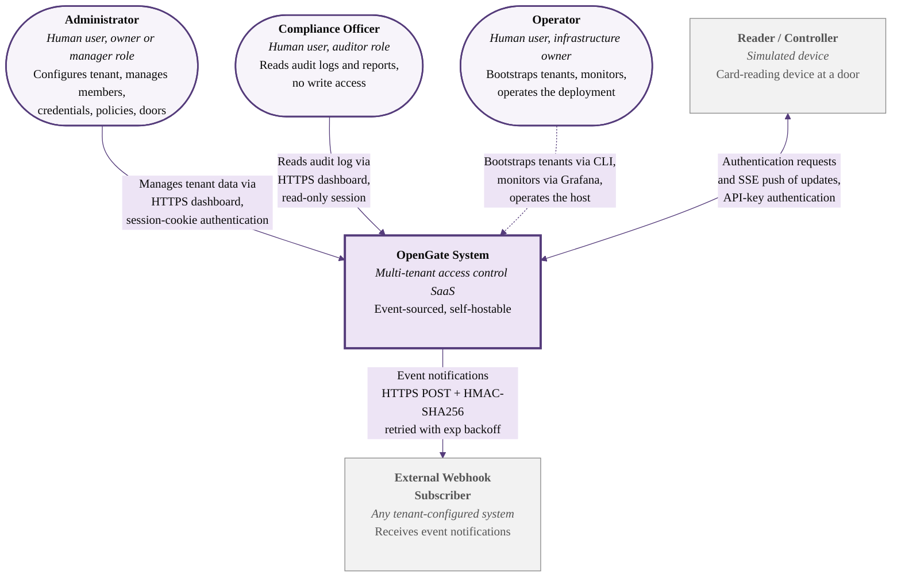
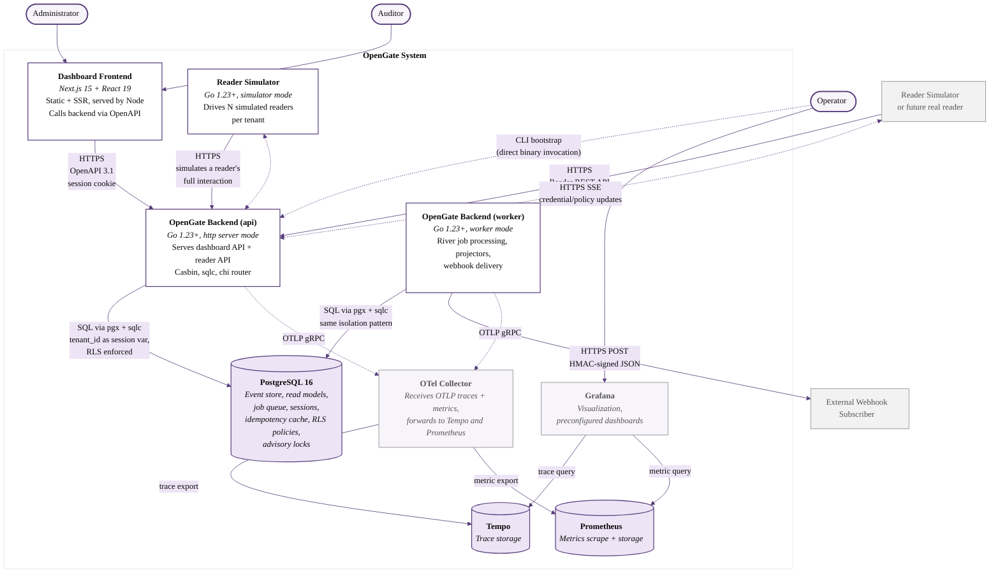
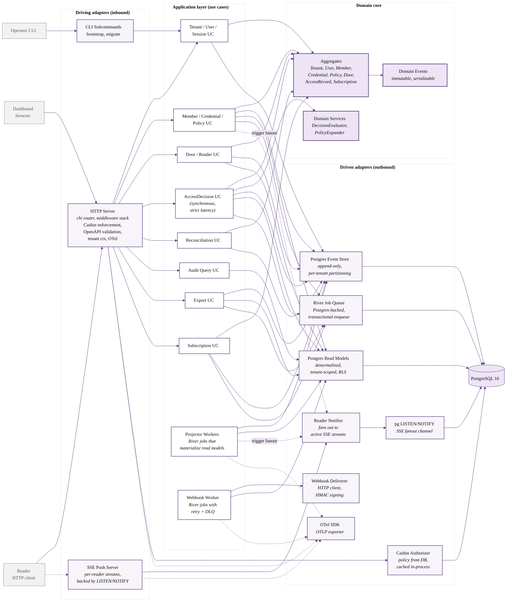
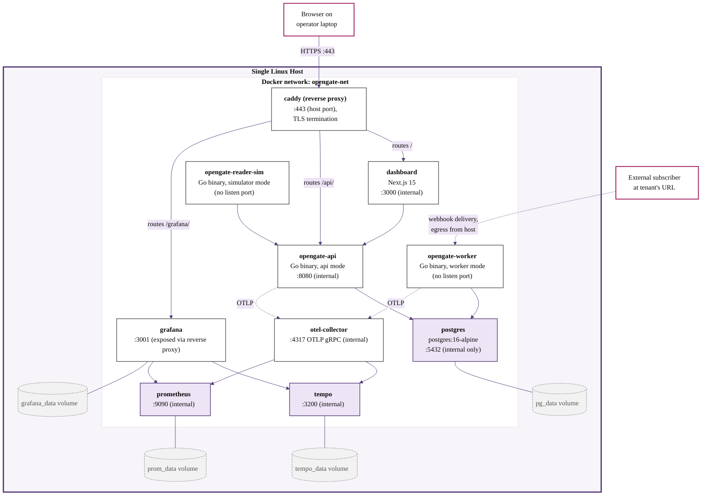
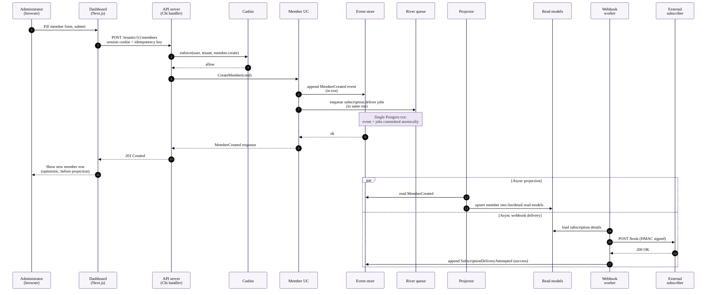
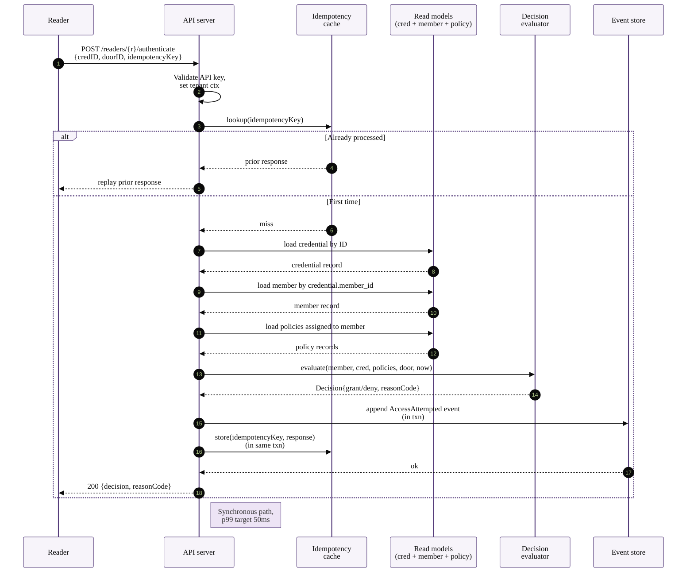
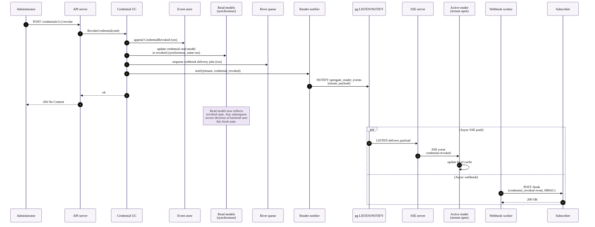
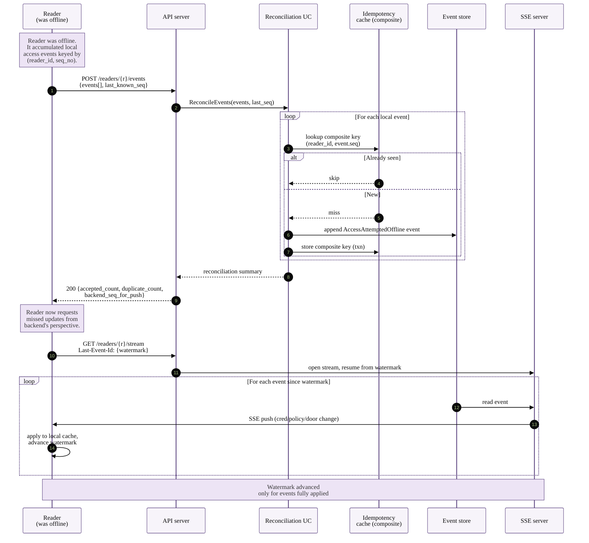
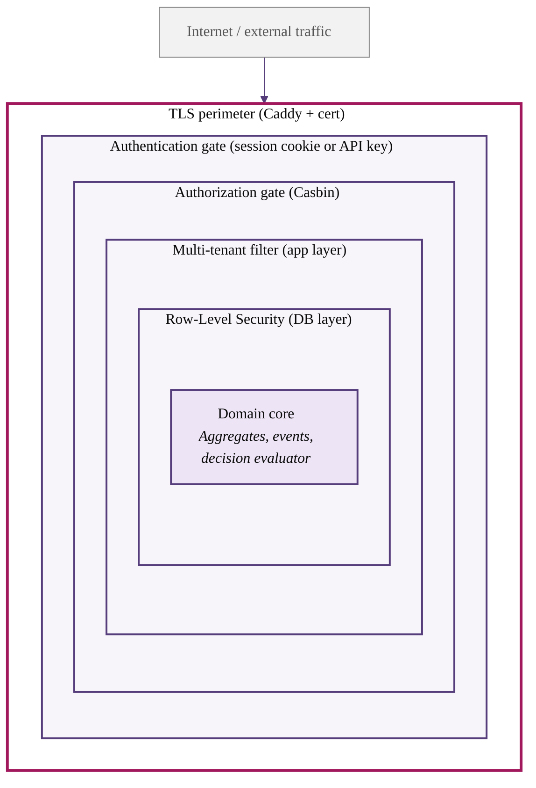

# OpenGate — System Architecture Document

**Version:** 1.0
**Status:** Draft for review
**Document type:** System architecture (C4-style, with hexagonal decomposition and deployment topology)
**Author:** Jelena Marjanović
**Date:** May 2026
**Predecessor documents:** opengate-prd-v1.md, opengate-pfd-v1.md
**Successor document:** opengate-system-design-v1.md (to be produced after this document is accepted)

---

## How to read this document

This document is the third layer in the OpenGate documentation set. The Product Requirements Document fixed what the system must be and what value it must deliver, and the Product Feature Document decomposed that intent into ten functional capability areas with explicit traceability back to twelve architectural patterns and six use case scenarios. The present document occupies the layer below those, in which the capability areas are realized as concrete software components with defined boundaries, defined contracts between them, and a defined deployment topology under which the whole system runs.

The framing convention used here is the C4 model proposed by Simon Brown, which is the documentation approach that has become the de facto standard in engineering organizations that practice structured architectural communication. C4 expresses an architecture as four nested levels of zoom. The first level shows the system as a single box situated within an environment of human actors and adjacent systems. The second level zooms into the system and reveals the major deployable containers that constitute it. The third level zooms into a container and reveals the software components within it. The fourth level zooms into a component and reveals its code-level structure. For OpenGate, the third level is the appropriate stopping point; level four is the territory of the code itself and does not need separate documentation in advance.

The document is read top to bottom, and each section builds on the section before it. The earliest sections fix the architectural style and vocabulary, the middle sections present the C4 diagrams from level one to level three, the later sections describe deployment, contracts, scenario flows, and cross-cutting concerns, and the closing sections enumerate the decisions that are deferred to the System Design document one layer below this one. A reader who is short on time and wants to extract the essence of the architecture in three minutes is invited to read sections two through five and then skip to the inter-component contracts in section eight; a reader who is preparing to implement is invited to read the entire document.

Two stylistic notes apply throughout. First, the document continues to use the heavy-prose style adopted in the PRD and PFD, with Mermaid diagrams placed as visual anchors at the points where they materially help comprehension rather than as decorative inclusions. Second, the brand palette is applied to all diagrams via Mermaid `classDef` directives, with imperial purple reserved for system boundaries and trust-relevant connectors, light lavender for data-bearing containers, the magenta-plum critical color for failure paths and do-not annotations, and the muted sage for verified or safe states. A reviewer who later wishes to export any diagram to SVG retains the palette automatically because it is encoded directly in the Mermaid source.

---

## 2. Architectural style

OpenGate's architecture composes four stylistic pillars, each of which contributes a different kind of structural discipline. The pillars are not orthogonal; they interact with one another in specific ways that the rest of the document explains, and understanding their interaction in advance makes the later sections easier to read.

The first pillar is **hexagonal architecture**, originally articulated by Alistair Cockburn in 2005 under the name "ports and adapters". The discipline of hexagonal architecture is the strict isolation of domain logic from the technologies through which domain logic communicates with the outside world. The domain layer declares abstract interfaces called ports for everything it needs to receive from outside (input ports, also called driving ports) and for everything it needs to send to outside (output ports, also called driven ports). The infrastructure layer provides adapters that implement these ports for specific technologies. The benefit is that the domain layer becomes independent of choices about persistence, transport, hardware, and observability, all of which can be changed by swapping adapter implementations without touching the domain. In OpenGate the discipline is taken seriously enough that the domain core has no import of any package outside the standard library and a small set of utility packages with no infrastructure dependencies; every database call, every HTTP request, every webhook delivery passes through a port.

The second pillar is **event sourcing**, in which all state changes are recorded as immutable, append-only events in a durable log, and current state is derived by folding the events. The benefit for OpenGate's domain is that the audit log becomes a structural guarantee rather than a feature to be implemented. Every grant decision, every credential issuance, every policy modification is an event in the log, and the log is the source of truth from which all derived views are computed. The implementation places the event log in Postgres, which is itself an adapter behind an EventStore port, preserving hexagonal discipline.

The third pillar is **Command-Query Responsibility Segregation**, abbreviated CQRS, which formalizes the split between the model used to process commands that change state and the models used to answer queries about state. In OpenGate, commands flow through aggregates that enforce invariants and emit events; queries are served from read models that are materialized from the event stream. The two sides are connected by projector workers that read events and update read models. The split lets each side be optimized independently: write-side aggregates are tight and transactional; read-side projections are denormalized and indexed for the specific query patterns they serve.

The fourth pillar is the **C4 model**, used for documentation rather than for runtime structure. C4 provides the four levels of zoom (context, container, component, code) and a small vocabulary of element types (person, system, container, component) that combine to express most architectural concerns without further notation. The document uses Mermaid as the rendering engine for the C4 diagrams; Mermaid is supported natively by GitHub since 2022 and renders directly in the README without external tooling, which keeps the entire documentation set self-contained within the repository.

These four pillars compose in a specific way. Hexagonal architecture provides the outer structure of the codebase, event sourcing provides the persistence and audit discipline within the domain core, CQRS provides the runtime split between command and query paths, and C4 provides the language for describing all of this to a reader. A reviewer who recognizes the pillars individually and understands how they interact is the intended audience; a reader who is encountering one or more of them for the first time will find each pillar accompanied by enough context in its respective section that the document remains self-contained.

---

## 3. System context: Level 1

The system context diagram presents OpenGate as a single opaque system surrounded by the actors and adjacent systems that interact with it. The diagram answers the most fundamental orientation questions: who uses the system, what neighboring systems does it integrate with, and what does the interaction at the boundary look like. Everything inside the OpenGate box is suppressed at this level and addressed in the next section.

The three human roles on the left side correspond exactly to the three Casbin roles defined in PFD section two. The administrator and compliance officer interact with OpenGate exclusively through the Next.js dashboard, using HTTPS with session-cookie authentication that the dashboard establishes after a successful username-and-password login. The operator is a different category of human, the person who deploys and operates the OpenGate instance itself; this person interacts with OpenGate through the CLI bootstrap tool that creates tenants and the bundled Grafana stack that displays operational telemetry. The operator role is not enforced by Casbin because the operator works at the layer below the application, with direct database and host access.

The two adjacent systems on the right side are the reader and the external webhook subscriber. The reader is bidirectional: it sends authentication requests into OpenGate when a credential is presented at a door, and it receives a continuous stream of credential and policy updates pushed from OpenGate via Server-Sent Events. The webhook subscriber is unidirectional in this diagram; OpenGate posts JSON-encoded event notifications to it with HMAC-SHA256 signatures that the subscriber verifies before processing.

The bidirectional arrow between Reader and OpenGate is significant because it is the visible-at-this-level manifestation of the dual-direction Reader port that this architecture document commits to. The next-level decomposition will reveal that this single bidirectional arrow corresponds to two distinct ports inside the application — one for inbound authentication requests and one for outbound state push — but at the context level the dual nature is hidden behind a single conceptual interaction.

---

## 4. Container view: Level 2

The container view zooms inside the OpenGate System box and reveals the major deployable units that compose it. Each container in C4 vocabulary is a separately runnable process: a Go binary, a database instance, a web frontend, a sidecar agent. Containers communicate with one another over network protocols, and the diagram makes those protocols explicit.

The container view reveals an organizational decision that is worth pausing on before going further. The OpenGate Backend appears in the diagram as two separate containers, named (api) and (worker), but both are produced from the same Go binary. The binary, when invoked, takes a subcommand on the command line that selects its mode of operation. In api mode it brings up the HTTP server, registers the dashboard and reader API handlers, and serves requests. In worker mode it does not listen on any HTTP port for application traffic; instead it registers the River job workers and the projector workers, which consume jobs and events from the database and produce side effects. In simulator mode, used by the third Go-backed container in the diagram, the binary runs the reader simulator harness that drives a configurable number of simulated readers against the api process.

The choice to use a single binary in multiple modes follows the pattern established by mature Go projects such as CockroachDB, Kubernetes, and Hashicorp Consul, in which one statically-linked binary contains every operational mode the system needs and the subcommand selects what runs. The benefits are operational simplicity (one image to build, one image to publish, one image to deploy in different roles) and code sharing (the application core is identical across modes, so changes propagate automatically). The cost is a slightly larger binary than would be necessary if each mode were its own program; for a portfolio-sized system this cost is negligible.

The Postgres container is the central nervous system of the architecture and serves several roles that in a larger system might be distributed across separate services. It holds the event store (append-only event tables, the source of truth), the read models (denormalized projections that serve queries), the session store (administrative sessions for the dashboard), the idempotency cache (replay protection for commands and access decisions), the River job queue (background work), the Casbin policy store (RBAC rules), and the Postgres-internal advisory locks used for distributed coordination. Postgres also provides Row-Level Security policies that enforce multi-tenant isolation as a database-level invariant beneath the application-level tenant filter. Concentrating these responsibilities in Postgres is a deliberate architectural choice motivated by the operational-simplicity argument in PRD section four: introducing a second persistence technology or a separate coordination service such as Zookeeper or Redis would expand the operational surface of the deployment without exercising any additional architectural pattern.

The observability stack on the right side of the OpenGate boundary consists of four containers that work together. The OTel Collector receives telemetry from the Go backend over OTLP gRPC, performs basic processing such as batching and resource attribution, and forwards traces to Tempo and metrics to Prometheus. Tempo stores traces in object-storage-style local volumes (in a Docker Compose deployment, simply local disk), and Prometheus stores metrics as time series. Grafana queries both backends and renders the preconfigured dashboards that ship with the repository. None of these containers is essential to OpenGate's functional correctness; the system runs without them, simply emitting telemetry to nowhere. The observability stack is included in the deployment because operating a system without observability is not a senior-engineering posture and the demonstration would be incomplete without it.

The protocol arrows in the diagram are colored with the primary accent because they cross trust boundaries within the system and at the system perimeter. The HTTPS edges from the dashboard, from the reader, and to the webhook subscriber are encrypted and authenticated; the OTLP edges from the Go containers to the collector and the SQL edges from the Go containers to Postgres are internal to the Docker network and rely on network isolation rather than transport encryption in the default Docker Compose deployment.

---

## 5. Component view: Level 3 (OpenGate Backend internals)

The component view zooms inside the OpenGate Backend container and exposes its internal structure. This is the level at which hexagonal architecture is most directly visible, because the entire arrangement of components is determined by the ports-and-adapters discipline. The diagram is read left to right, in the direction of the data flow that drives the application, and the components are grouped by architectural role.

The diagram is dense and rewards a slow read. Three architectural truths are visible in it and worth naming explicitly. The first truth is that domain code sits in the middle and is reached only through use case interfaces that are themselves contained in the application layer; nothing inside the dashed Domain core subgraph imports anything outside it. This is the hexagonal isolation property in concrete form. The second truth is that every persistence, transport, and external-system interaction passes through a driven adapter, which means that swapping the database from Postgres to something else, or swapping the webhook transport from HTTP to a message bus, requires changes only in the adapter implementations and not in the use cases or the domain. The third truth is that the inbound and outbound directions of reader interaction are visibly separated: inbound authentication requests enter through the HTTP server like any other API call and route to the AccessDecision use case, while outbound credential and policy updates flow from use cases or projectors through the Reader Notifier adapter, into the Postgres LISTEN/NOTIFY channel, and back out through the SSE Push Server to whichever readers happen to be listening at the time. This is the Option-One resolution of the Reader-port question, materialized.

The component grouping in the diagram corresponds directly to the Go package structure that the implementation will adopt. The driving adapters live under `internal/adapters/inbound/`, the use cases live under `internal/application/`, the domain core lives under `internal/domain/`, and the driven adapters live under `internal/adapters/outbound/`. The ports themselves — the interfaces that the use cases declare and the adapters implement — live under `internal/ports/` and are split into `inbound/` and `outbound/` to make their direction explicit at the file level. A new contributor reading the package layout can therefore reconstruct the architecture from the directory tree alone.

A particular observation about the AccessDecision use case is worth surfacing here because it foreshadows the latency analysis in the system design document. The AccessDecision use case is the only use case in the diagram that reads from the read models on the synchronous request path. Every other use case writes to the event store and lets the read models catch up asynchronously through the projector workers. AccessDecision cannot afford that latency because the fifty-millisecond p99 target leaves no time for an event-store replay; it therefore reads directly from the materialized read models and writes a single event back to the event store in the same transaction. This dual-read-and-write nature is part of why the AccessDecision component is highlighted with thicker borders in implementations of similar systems, and why the projection strategy for the read models that AccessDecision depends on must be synchronous within the command transaction rather than asynchronous afterward. The exact projection strategy per read model is a System Design concern and is deferred there.

---

## 6. Hexagonal architecture: ports and adapters mapping

The previous section's component diagram shows the ports and adapters at a glance, but the precise mapping between every port the domain declares and every adapter that implements it deserves explicit enumeration because the discipline of hexagonal architecture is verifiable only when this mapping is documented. The mapping that follows is organized by port, with a brief description of each port's responsibility and an enumeration of the adapter implementations that ship with the project.

The inbound (driving) ports are interfaces declared in the application layer that represent use case capabilities. They are called by driving adapters when the outside world drives the application. The first inbound port group is the administrative ports, including TenantManagement, UserManagement, SessionManagement, MemberManagement, CredentialManagement, PolicyManagement, DoorManagement, and SubscriptionManagement. Each of these is implemented by exactly one use case in the application layer and is called from the HTTP server adapter when an authenticated administrative request arrives. The second inbound port is AccessRequestHandler, which is the port through which authentication requests from readers flow into the application; it is implemented by the AccessDecision use case and is called from the HTTP server adapter when a request arrives at the reader API endpoint. The third inbound port is ReconciliationHandler, implemented by the Reconciliation use case, called by the HTTP server adapter when a reader posts events from an offline window. The fourth inbound port is QueryHandler with sub-ports per query category (AuditQuery, MemberQuery, DoorQuery, and so on), implemented by the corresponding query use cases. The fifth inbound port is ExportHandler, implemented by the Export use case, called both from the HTTP server adapter when an administrator initiates an export and from a River job worker when the export job executes.

The outbound (driven) ports are interfaces declared by the domain or application layer that represent capabilities the domain needs from the outside world. They are implemented by driven adapters in the infrastructure layer. The first outbound port is EventStore, with a method for appending events to a stream and a method for reading events from a position; it is implemented by the PostgresEventStore adapter for production use and by an InMemoryEventStore adapter for unit tests. The second outbound port group is the read model repositories, with one port per read model (MemberReadModel, CredentialReadModel, PolicyReadModel, DoorReadModel, AccessAuditReadModel, SubscriptionReadModel, ExportStatusReadModel); each is implemented by a corresponding PostgresReadModel adapter and by an InMemoryReadModel adapter for tests. The third outbound port is JobEnqueuer, with a method for enqueueing a job within a transaction; it is implemented by the RiverJobEnqueuer adapter for production and by an InMemoryJobEnqueuer for tests. The fourth outbound port is Authorizer, with methods for checking whether a subject is permitted to perform an action on a resource; it is implemented by the CasbinAuthorizer adapter for production and by a permissive FakeAuthorizer for unit tests where authorization is not the subject under test. The fifth outbound port is WebhookDeliverer, with a method for delivering a single webhook to a single subscriber; it is implemented by the HTTPWebhookDeliverer adapter for production and by a RecordingWebhookDeliverer for tests that need to assert what was delivered. The sixth outbound port is ReaderNotifier, with a method for notifying a set of readers about a state change; it is implemented by the SSEReaderNotifier adapter for production, which writes the notification to a Postgres LISTEN/NOTIFY channel from which the SSE server picks it up and pushes to active reader connections.

A pair of cross-cutting outbound capabilities deserves mention because they do not fit cleanly into the port-adapter pattern but are nonetheless required for the system to operate. Telemetry instrumentation is performed by attaching spans to the request context at the driving adapter and propagating that context through every call into the use cases and the driven adapters. The OpenTelemetry SDK is configured at process startup and is not abstracted behind a port, because attempting to abstract telemetry behind a port produces noticeably worse code than letting the SDK be present at the call sites where instrumentation matters. The same observation applies to structured logging, which uses the standard library `log/slog` package directly throughout the codebase rather than being wrapped behind a port.

The two test-only adapter implementations enumerated above (InMemoryEventStore, FakeAuthorizer, and so on) deserve a final note. Their purpose is not only to make unit tests faster than they would be against Postgres, but to verify that the production adapters and the test adapters both satisfy the same port interface and produce semantically equivalent results. The contract test suite, run in CI, applies the same set of acceptance tests to both the in-memory and the Postgres implementations of every port that has both kinds. A divergence in behavior between the implementations is therefore caught at test time rather than at runtime in production. This is the contract testing pattern enumerated in PRD section four, manifested at the adapter level.

---

## 7. Deployment topology

The deployment topology for OpenGate within the project window is a single Linux host running Docker Compose, with all containers from the level-two diagram realized as Compose services. The choice was justified in PRD section ten, but the precise shape of the Compose configuration deserves a diagrammatic representation because it is the form in which a reviewer will first encounter the system when bringing it up locally.

The deployment is intentionally minimal in operational surface. The only port exposed to the host network is the reverse proxy's port 443, behind which Caddy terminates TLS using a certificate from Let's Encrypt or a self-signed certificate for local development. All other inter-service traffic stays on the internal Docker network named opengate-net and is not reachable from outside the host. The reverse proxy routes the URL prefix `/` to the Next.js dashboard, the prefix `/api/` to the Go API server, and the prefix `/grafana/` to the Grafana instance, allowing the operator to access both the application and the operational dashboards under a single domain.

The four named volumes attached to the data-bearing services preserve their state across container restarts and across recreations of the Compose stack. The `pg_data` volume is the most important of these because losing it loses the entire event store, which means losing the entire history of the system. In a production deployment the volume would be replicated and backed up; in the portfolio sample, the volume is a local Docker volume on the host with documentation that points the operator to a manual backup procedure based on `pg_dump` plus periodic copies to off-host storage.

The reader simulator service is configured at startup with the number of tenants to simulate and the number of readers per tenant. Each simulated reader, on startup, registers itself with the API by calling the reader provisioning endpoint, receives an API key in response, persists the API key in a local file within its container's writable volume so that restarts do not produce new readers, and then enters its main loop in which it issues periodic heartbeats and randomly generated authentication requests. The simulator is the closest analog to a fleet of real readers that the project produces.

A future deployment that targets a real production environment would replace this single-host Docker Compose configuration with a Kubernetes manifest or a Helm chart. The architectural decisions made here are compatible with such a migration: the stateless containers (api, worker, reader simulator, dashboard, otel-collector, grafana) become Kubernetes Deployments, the data-bearing containers (postgres, tempo, prometheus) become StatefulSets with persistent volume claims, and the reverse proxy is replaced with a Kubernetes Ingress. The Docker Compose configuration is the right granularity for the portfolio window but is not the upper limit of where the architecture can go.

---

## 8. Inter-component contracts

Four major contracts govern the interactions between components and between OpenGate and its external environment. Each contract is documented here at the level of detail necessary for a reader to understand what the contract is and to recognize the contract when reading the code; the wire-level minutiae such as full OpenAPI specifications and exhaustive payload schemas live in the dedicated contract documentation that ships with the repository.

### 8.1 Dashboard API contract

The dashboard API is the HTTP surface that the Next.js dashboard frontend consumes and that the operator's automation, if any, also consumes. The contract is expressed as an OpenAPI 3.1 specification, stored in the repository at `api/openapi.yaml`, that serves as the single source of truth from which both the server-side request validators and the client-side TypeScript types are generated. The server uses `kin-openapi` to load the schema at startup and to validate every inbound request against the schema before passing the request to the handler; the client uses `openapi-typescript` to generate TypeScript type definitions and a typed fetch wrapper. A breaking change to the schema is detectable in CI through a schema-diff job, and a non-breaking change propagates through the type generation pipeline to the dashboard without manual intervention.

The endpoints are organized by capability area, with URL prefixes that correspond directly to the capability area names from the PFD. The administrative endpoints sit under `/api/v1/tenants/{tenant_id}/...` with sub-paths for `members`, `credentials`, `policies`, `doors`, `subscriptions`, `audit`, and `exports`. Authentication is by session cookie, established by a successful POST to `/api/v1/auth/login` and torn down by a POST to `/api/v1/auth/logout`. Every endpoint that mutates state accepts an `Idempotency-Key` header; the server records the key together with the response and replays the same response if a request with the same key arrives again within the idempotency retention window.

Errors are returned according to RFC 9457 Problem Details for HTTP APIs, with a JSON payload containing `type`, `title`, `status`, `detail`, and, for validation errors, a structured `errors` array identifying the offending fields. Status codes follow standard REST semantics with the caveats that 409 Conflict is used for idempotency-key collisions where a different request arrived under a previously-used key, and 412 Precondition Failed is used for optimistic-concurrency violations on aggregates that support versioning.

### 8.2 Reader protocol contract (dual direction)

The reader protocol is the contract by which OpenGate and a reader (whether simulated or in a hypothetical future hardware integration) communicate. The protocol is dual-direction, as fixed in the architectural decision earlier in this document, and consists of an inbound side over which readers send requests into OpenGate and an outbound side over which OpenGate pushes updates to readers.

The inbound side is a small REST API served under `/api/v1/readers/{reader_id}/...`. The four endpoints on this side are POST `authenticate`, which submits a credential identifier and door identifier and receives a decision; POST `events`, which accepts a batch of access events that the reader recorded locally during an offline window and that must be reconciled into the audit log; POST `heartbeat`, which the reader calls on a configurable interval (default thirty seconds) to indicate that it is alive and responsive; and POST `provision`, which is the one-time call made by a fresh reader to obtain its API key and complete the initial handshake with the system. All inbound endpoints accept an `Idempotency-Key` header, which the access decision endpoint and the events endpoint use to handle retry-induced duplicates.

The outbound side is a Server-Sent Events stream served at GET `/api/v1/readers/{reader_id}/stream`. A reader establishes the stream on startup and keeps it open for the duration of its operation, reconnecting with exponential backoff on disconnection. The server pushes a sequence of typed messages over the stream, encoded as SSE event types: `credential.issued`, `credential.revoked`, `credential.expired`, `policy.updated`, `policy.assigned`, `policy.unassigned`, `door.config.updated`, `tenant.config.updated`, and the heartbeat-style `keepalive` sent periodically to keep intermediate proxies from closing the connection. Each message carries a monotonically increasing sequence number that the reader uses as its synchronization watermark; on reconnection, the reader supplies the last sequence number it received in a `Last-Event-Id` header and the server resumes from the next message rather than re-sending the entire stream from the beginning.

Authentication on both sides of the reader protocol is by API key, presented as a `Bearer` token in the `Authorization` header. The API key is issued once during the reader's provisioning call, is associated with the reader and the tenant in the database, and is stored in the database as an Argon2id hash so that a database compromise does not directly expose the key. Key rotation is supported through a manager-role administrator operation that generates a new key and accepts payloads signed with either the old or the new key for a configurable overlap window.

The choice of SSE over WebSocket for the outbound direction deserves a brief justification because it is a non-obvious architectural decision. SSE is one-directional from server to client and is therefore strictly less expressive than WebSocket, which is bidirectional. However, OpenGate's outbound stream is genuinely one-directional in this design; readers do not need to send unsolicited messages over the same connection because they have the inbound REST API for that. SSE is also simpler operationally: it runs over plain HTTP without protocol upgrades, it works through any HTTP-aware proxy without configuration, it includes automatic reconnection and event-id resumption in the browser's EventSource API (and equivalent libraries for Go and other languages), and it is supported by standard reverse proxies and load balancers without sticky-session configuration. The trade-off is accepted; bidirectional readers, if a future requirement, would use additional inbound POST endpoints rather than upgrading the outbound stream.

### 8.3 Webhook delivery contract

The webhook delivery contract is the protocol by which OpenGate notifies external systems of tenant events. The contract is one-directional: OpenGate posts to the subscriber's URL, the subscriber responds with a status code, and there is no callback or follow-up. The payload is JSON-encoded with a stable top-level envelope that distinguishes the event type, the tenant, the version of the schema, and the event-specific data block.

A delivery request includes three headers beyond the standard ones. The first is `Content-Type: application/json`. The second is `OpenGate-Signature`, containing a comma-separated list of timestamp-and-signature pairs in the format `t=1717603200,v1=hex_hmac_sha256_signature`. The signature is computed over the concatenation of the timestamp, a literal period character, and the request body, using HMAC-SHA256 keyed with the subscription's shared secret. The third header is `OpenGate-Webhook-Id`, a globally unique identifier for the delivery that the subscriber may use for deduplication if the same payload arrives twice due to retries. The signature scheme deliberately follows the convention popularized by Stripe; subscribers who have integrated Stripe webhooks will recognize the pattern without further explanation.

The retry behavior is detailed in PFD section ten and is not repeated here. The dead-letter queue handling is also detailed there. What deserves an architectural note is the interaction between the webhook delivery contract and the event store: every webhook delivery is itself an event in the event store (with type `subscription.delivery.attempted` and outcome attribute) so that the delivery history is auditable in the same way that domain events are auditable. The dead-letter queue is therefore a read model derived from these delivery-attempt events rather than a separate table that loses its history when entries are purged.

### 8.4 Tenant data export contract

The tenant data export contract specifies the format of the archive produced by the export capability and the verification procedure that a recipient applies to confirm the archive's integrity. The archive is a single file with the extension `.opengate-export.tar.gz`, in which the top-level structure is a tar archive that, when extracted, produces a single directory whose contents are organized as follows. The root of the extracted directory contains `manifest.json`, the metadata file that describes the export and lists checksums of every other file. The root also contains `manifest.json.sig`, a detached Ed25519 signature of the manifest computed with the deployment's signing key. Three subdirectories sit next to the manifest. The `events/` subdirectory contains the entire event stream, grouped by aggregate type and by month, with files such as `events/member/2026-05.json.gz` and `events/access/2026-05.json.gz`. The `read-models/` subdirectory contains snapshots of every materialized read model at the moment the export was taken, with one file per read model. The `config/` subdirectory contains tenant configuration including webhook subscriptions (with secrets redacted), Casbin policy snapshots, and user records (with password hashes redacted).

The verification procedure that a third-party recipient executes is documented in the architecture documentation that ships with the repository. The procedure fetches the deployment's signing public key from the well-known URL `https://{deployment-host}/.well-known/opengate-signing-key.pub`, verifies the detached signature on the manifest using Ed25519, recomputes the checksums of every file referenced in the manifest, and compares them against the checksums recorded in the manifest. If all checks pass, the export is verified; if any check fails, the export is considered tampered or corrupted and is not to be trusted.

The choice of Ed25519 for the signature scheme is motivated by its small signature size, fast verification, deterministic output, and the absence of the parameter-choice pitfalls that historically have plagued RSA implementations. The Go standard library provides Ed25519 directly through `crypto/ed25519`, so no third-party dependency is introduced for the signing implementation.

---

## 9. Scenario flows: how the architecture handles the PRD scenarios

The static diagrams in the previous sections show what components exist and how they connect, but they do not show how the components cooperate over time to fulfill a request. This section walks through four of the six scenarios from PRD section five as sequence diagrams, each accompanied by enough prose to explain the steps and the decisions made along the way. The four scenarios chosen are member enrollment with webhook delivery, member access attempt at a door, immediate revocation propagation, and offline reconciliation. The remaining two scenarios (audit queries and tenant data export) are simpler in structure and are not given dedicated sequence diagrams here; their flows can be reconstructed from the read-only query path and the export job description in the previous sections.

### 9.1 Member enrollment with webhook delivery (Scenario 1)

The interesting properties of this flow are concentrated in the boxed note around steps five and six. The MemberCreated event and the webhook-delivery job are written within a single Postgres transaction, which means either both are durable or neither is. This is the transactional-outbox pattern, and it is what makes River the right choice for the job queue: River stores its jobs in Postgres tables and so participates in the same transaction as the event store. If the system instead used a separate message broker such as RabbitMQ or NATS, the same atomicity would require a more elaborate two-phase commit or saga construction. The simplicity of the single-transaction approach is one of the operational-simplicity decisions called out in the PRD.

The projection of the new member into the read models and the delivery of the webhook to the subscriber happen in parallel, asynchronously, after the transaction commits. The dashboard already received its 201 response before either of these completed, and the dashboard's display of the new member uses the response payload directly rather than re-querying the read models — an optimistic UI strategy that hides the projection latency from the user. If the user subsequently navigates away and back, the read model is by then up to date and the navigation succeeds; the freshness lag of the read model is typically tens of milliseconds under normal load.

### 9.2 Member access attempt at a door (Scenario 2)

The synchronous-path property is what makes this scenario architecturally distinct from member enrollment. The AccessAttempted event is written to the event store in the same transaction that produces the response to the reader, and the response is not returned until that transaction commits. There is no window during which a decision can be returned but the audit record lost. The idempotency cache entry is written in the same transaction, ensuring that a retry of the same idempotency key returns the same response even after a process restart.

The choice to perform the synchronous event write in the same transaction has a latency cost, but the cost is small. A single-row insert into the event store, with the indexes the schema design uses, completes in single-digit milliseconds against a healthy Postgres instance. The fifty-millisecond p99 budget can absorb this cost comfortably along with the read model lookups and the policy evaluation. The result is a system that is both performant and durable on this critical path; the rare alternative of returning the response first and writing the event asynchronously would buy a few milliseconds at the cost of a window of audit gaps that an auditor would not accept.

### 9.3 Immediate revocation propagation (Scenario 4)

The revocation flow is the architecture's response to one of the subtlest correctness properties in the system. The requirement, stated in PFD section seven, is that any access decision evaluated by the backend after the revocation timestamp must result in a deny, even if the reader's local cache is not yet aware of the revocation. The mechanism is straightforward: the credential read model that the AccessDecision use case reads is updated synchronously in the same transaction that writes the CredentialRevoked event. There is no window during which the event is durable but the read model still says the credential is active.

The reader's local cache is, of course, asynchronously updated through the SSE push, and the latency between the revocation and the cache refresh at the reader is on the order of tens of milliseconds when the reader is online. During this small window, the reader could grant access locally based on its stale cache. The system accepts this small window because the backend will see the access attempt regardless (the reader sends every authentication to the backend even when it has a local cache, in the online mode), and the backend's decision will be deny because its read model is fresh. The reader's local cache exists for the offline mode, not for performance in the online mode. The offline reconciliation scenario described next is where the cache truly matters.

### 9.4 Offline reconciliation (Scenario 3)

The reconciliation scenario is the most distributed-systems-flavored scenario in the system, and the sequence diagram makes the dedup mechanism explicit. The reader transmits all of the events it accumulated while offline; each event carries a composite identifier `(reader_id, sequence_number)` that is durable across reader restarts. The Reconciliation use case looks up each composite identifier in the idempotency cache; an identifier that is already present means the event was already accepted on a prior reconciliation attempt and the second submission is acknowledged but does not produce a duplicate event in the store. An identifier that is not present is accepted, the event is appended to the event store, and the identifier is recorded in the idempotency cache. The transaction boundary contains both the event append and the idempotency record so that either both are durable or neither is.

The push direction of reconciliation, where backend state changes are propagated to the reader, runs as a normal SSE stream resumption. The reader includes its last-known watermark in the `Last-Event-Id` header on the GET request for the stream; the SSE server resolves the watermark against the event store and pushes every event since the watermark in order. The watermark is advanced at the reader only for events fully applied, which means that a mid-stream disconnection results in the reader resuming from the last fully-applied event on the next reconnection rather than losing any state. The convergence property is therefore eventually guaranteed regardless of how flaky the connection is, as long as it eventually stays up long enough for the pending event count to be drained.

---

## 10. Cross-cutting concern: observability

Observability in OpenGate is built into the architecture rather than added on as a layer. The OpenTelemetry SDK is initialized at process startup and attached to the request context at the driving adapter boundary, and from that point on every call into a use case, every call from a use case into a driven adapter, and every database query is wrapped in a span automatically by the instrumentation libraries that integrate with `chi`, `pgx`, `river`, and the standard `net/http` client. The result is that a single inbound HTTP request produces a complete trace covering the entire request lifecycle including the asynchronous side effects, with each span carrying the standard set of attributes plus the OpenGate-specific attributes such as `opengate.tenant_id`, `opengate.command_type`, and `opengate.decision_outcome`.

The propagation of trace context across asynchronous boundaries deserves a note because it is the property that distinguishes a serious observability implementation from a superficial one. When a use case enqueues a River job within a transaction, the trace context of the current span is serialized into the job arguments. When the River worker later picks up the job, it deserializes the trace context, opens a span that is a child of the original, and proceeds. The trace stitching that results allows a reviewer in Grafana Tempo to follow a single request from the inbound HTTP layer through the command processing, through the event store write, through the asynchronous projection job, all the way to the webhook delivery to an external subscriber, with every step represented as a span on a single timeline. This is the demonstration of end-to-end OpenTelemetry tracing that PRD section four calls out as one of the twelve patterns, and the architecture is shaped to make it possible.

Metrics are emitted from the same instrumentation that produces spans. Histograms of request latency are emitted by the HTTP server middleware. Counters of event store writes are emitted by the PostgresEventStore adapter. Gauges of read model freshness lag are emitted by the projector workers on every update. Histograms of decision latency are emitted by the AccessDecision use case at the top-level boundary, separately from the lower-level metrics that decompose the same latency into its constituent parts. The full set of metrics is documented in the observability documentation that ships with the repository and is included in the preconfigured Grafana dashboards.

The health check endpoints, exposed on the same HTTP server as the application API but on a separate path prefix `/health/`, distinguish liveness from readiness as described in PFD section twelve. The liveness endpoint at `/health/live` is a trivial 200-returning handler that signals that the process is responsive; the readiness endpoint at `/health/ready` performs a quick check that the database connection pool is healthy, that the River queue has been reached, and that the process is not in the middle of a graceful shutdown sequence. The orchestrator (Docker Compose's health checks in this case, Kubernetes liveness and readiness probes in a future deployment) uses these endpoints to decide whether to route traffic and whether to restart the container.

---

## 11. Cross-cutting concern: security

The security architecture of OpenGate is structured as a series of independent layers, each of which addresses a different class of threat and each of which would have to fail individually for a compromise to succeed. The layering is the defense-in-depth principle, applied not as an aspiration but as a concrete construction.

The outermost layer is **transport security**. The reverse proxy (Caddy in the default Docker Compose deployment) terminates TLS at the host boundary and proxies decrypted traffic to the internal services over the Docker network. The default Caddy configuration uses Let's Encrypt certificates when running on a public domain and self-signed certificates for local development; the operator can substitute their own certificates by mounting them into the Caddy container's volume. Inside the Docker network, inter-service traffic is unencrypted in the default deployment because the network is isolated to the single host; a future multi-host deployment would add mutual TLS between services using a service mesh.

The next layer is **authentication**. There are two authentication mechanisms in the system, corresponding to the two classes of actor that reach the API server. Administrative users authenticate with username and password against the local user store, and on success receive a session cookie that the dashboard uses for subsequent requests. The session cookie is HttpOnly, Secure, SameSite=Lax, and carries an opaque session token rather than any user identity directly. The session token is stored in the database with the user ID and expiry time, and the application looks up the session on every request. Reader clients authenticate with an API key issued at provisioning time, presented as a Bearer token in the Authorization header. The API key is stored as an Argon2id hash in the database.

The next layer is **authorization**. Every request that passes authentication is subjected to a Casbin policy check before any business logic runs. The Casbin model encodes the three roles (owner, manager, auditor) and the relationships between roles and operations. The policy is loaded into the Casbin engine at application startup from the database and cached in-process for performance; policy changes propagate to all application instances via a periodic refresh and a pg LISTEN/NOTIFY signal. The authorization layer is short-circuit-friendly: a request that fails the authorization check produces a 403 Forbidden response without ever touching the use case or the database.

The next layer is **multi-tenant isolation**. As described in PFD section two, the isolation is implemented as defense-in-depth with the application layer and the database layer both enforcing the boundary independently. The application layer includes the tenant identifier in every SQL query as a filter; the database layer enforces Row-Level Security policies that constrain the rows visible to a connection based on a Postgres session variable set at connection checkout. A bug in the application layer that omits the tenant filter would not result in cross-tenant data exposure because the database would still filter the rows; conversely, an RLS policy that fails to cover a particular table or query path would still be backed up by the application-layer filter.

The next layer is **idempotency and replay protection**. The dashboard API, the reader inbound API, and the webhook delivery contract all use idempotency keys to handle retries. The dashboard's idempotency cache records command results for ten minutes; the reader's idempotency cache for access decisions also records for ten minutes; the reconciliation idempotency cache, which uses composite keys of (reader_id, seq_no), records for the entire retention window of the corresponding event because reconciliation can resume long after an offline window. Webhook recipients are encouraged in the documentation to deduplicate on the `OpenGate-Webhook-Id` header for their own replay protection.

The next layer is **integrity protection** for outbound communication. The webhook signing scheme described in section eight protects subscribers from forged payloads, and the tenant data export signing scheme protects recipients of an export from tampered archives. Both schemes use the deployment's signing key for the Ed25519 case and the subscription-specific shared secret for the HMAC case; the keys are stored in environment variables or, in a hardened deployment, in a Linux secrets file mounted into the container.

The innermost layer is **secrets handling**. Secrets do not appear in source code, in commit history, in configuration files committed to the repository, or in log output. The mechanisms for secret injection are environment variables at the lowest tier, mounted secrets files at the next tier, and integration with an external secrets manager such as Vault or AWS Secrets Manager at the production tier (out of scope for the project window but documented as the path forward). Secrets that the application generates at runtime, such as session tokens, are produced from `crypto/rand` and never derived from low-entropy sources.

The diagram below shows the layers as a series of concentric trust boundaries around the domain core, with the magenta-plum critical color marking the perimeter of the system and the boundaries where authentication and authorization gates exist.

---

## 12. Failure modes and resilience

A system that does not document its failure modes is one whose operators discover them in production. This section enumerates the principal failure modes that the OpenGate architecture must withstand, and the response strategy for each.

The most consequential failure mode is **Postgres unavailability**. Because Postgres is the central nervous system of the architecture, an unreachable database produces a system that cannot accept commands, cannot serve queries, cannot make access decisions, and cannot make progress on background work. The system's response is to fail fast: the HTTP API returns 503 Service Unavailable for any request that requires the database, the readiness check returns failure so that the orchestrator stops routing new traffic, and the application logs the failure at error level. River workers exhibit similar behavior, retrying their database operations with exponential backoff and surfacing persistent failures to operator-visible metrics. There is no fallback to a degraded mode because no degraded mode would be safe; an access control system that grants by default when its database is unavailable is a worse failure than one that denies by default. The recovery is operator-driven; the operator brings Postgres back up and the system resumes normal operation. The event store and the read models are consistent at all times by virtue of the transactional boundary, so resumption does not require any reconciliation.

The next failure mode is **River worker failure**. A worker that crashes during job processing has its job returned to the queue by River's lease-and-retry mechanism, and another worker (or the same worker after a restart) picks it up. Jobs that fail their entire retry budget are moved to River's dead-letter store; the operator inspects the dead-letter store through River's introspection facilities and decides whether to retry or to discard. The system's view of read model freshness lag, exposed as a metric, signals when projector jobs are persistently failing; an operator who sees the lag growing investigates the failing job and fixes the underlying cause.

The next failure mode is **reader disconnection**. A reader that loses its SSE stream attempts to reconnect with exponential backoff. The HTTP server tolerates reconnections without state on its side because the SSE stream is stateless apart from the watermark that the reader provides on resumption. A reader that goes fully offline switches to its local cache for access decisions and accumulates events locally; on reconnection, the reconciliation flow described in section nine restores convergence. The system's view of reader connectivity, exposed as a metric per reader, signals which readers have been offline for an unusually long time, and an operator who notices this investigates the network connectivity at the reader's location.

The next failure mode is **persistent webhook subscriber failure**. A subscriber that returns 5xx persistently exhausts the retry budget after twenty-four hours, after which the delivery is moved to the dead-letter queue. Subsequent deliveries to the same subscriber continue to be attempted (the dead-letter is per-delivery, not per-subscription), but the operator can disable the subscription manually if the subscriber is known to be down for an extended period. A subscriber that returns 4xx, typically because of a payload mismatch or an authentication issue, is treated the same way by default; the architecture documentation recommends that subscription owners monitor their delivery success rate and respond to dead-letter accumulation rather than expecting OpenGate to disable subscriptions automatically.

The next failure mode is **graceful shutdown under load**. When the application receives a SIGTERM signal, the shutdown sequence proceeds as described in PFD section twelve. The readiness check returns failure first to drain new traffic, then in-flight requests are allowed to complete up to a configurable timeout, then the River worker pool is stopped with its own drain timeout, then the OpenTelemetry trace buffers are flushed, then the database connection pool is closed, and only then does the process exit. If any phase exceeds its timeout, the phase is forced to terminate and the next phase begins; the process logs a warning for the forced termination so the operator can investigate.

The next failure mode is **disk exhaustion**. A Postgres instance whose volume fills up stops accepting writes, which propagates immediately to every component of the system as a write failure. The architecture does not attempt to handle this case gracefully; the operator is expected to monitor disk usage through the bundled Grafana dashboard and to take action before the disk fills. The architecture documentation includes guidance on disk-usage planning, retention policies for events and audit log entries, and procedures for archiving old data to off-system storage as the deployment grows.

The final failure mode is **clock skew between the backend and a reader**. A reader whose clock is significantly ahead of or behind the backend's clock will produce decisions whose timestamps disagree with the backend's perception of time, and time-window policy evaluations will produce different results depending on which clock is consulted. The architecture's response is to use the backend's clock as the authoritative one for all backend-evaluated decisions, and to record the reader's reported clock together with the backend's clock for any controller-local decisions, so that the discrepancy is visible in the audit log. The architecture documentation recommends that real-deployment readers synchronize their clocks via NTP and treats simulated readers as having clocks pinned to the backend's clock by definition.

---

## 13. Deferred decisions

A number of architecture-adjacent decisions are not made in this document because they belong properly to the System Design document. They are listed here for visibility so they are not forgotten and so that a reviewer reading this document can recognize them as known unknowns rather than as omissions.

The exact projection strategy per read model — synchronous within the command transaction versus asynchronous via a River projector job — is deferred. The general split has been articulated: read models that the AccessDecision use case depends on must be synchronous because the synchronous decision path cannot tolerate projection lag, and read models that serve administrative and audit queries can be asynchronous because their freshness requirement is on the order of seconds rather than milliseconds. The per-read-model decision is the System Design document's job.

The exact partitioning strategy for the event store, including whether to partition by tenant identifier, by time window, or by some combination, is deferred to the Database Schema document. This document has assumed that the event store can be queried efficiently by tenant; the schema document specifies how.

The exact format of the trace span names and attribute keys that the OpenTelemetry instrumentation emits is deferred to the System Design document. This document has committed to the existence of comprehensive tracing; the System Design document specifies the schema.

The choice of Argon2id parameters for password hashing and the choice of HMAC iteration parameters for any session-related signing are deferred to the System Design document.

The exact algorithm for backend-generated credential identifier allocation, within the advisory-lock-protected critical section, is deferred to the System Design document.

The exact wire format of the SSE messages over the reader stream, including the JSON schema of each message type, is deferred to the contract documentation that ships with the repository alongside the OpenAPI specification.

The exact configuration of the bundled Grafana dashboards, including the panel layouts and the query expressions, is deferred to the observability documentation that ships with the repository.

---

## 14. Document status and next steps

This document is version one point zero of the System Architecture document for OpenGate. Subsequent revisions will be numbered version increments with appended changelogs.

The next document to be produced in the OpenGate documentation set is the System Design document. The System Design document treats the components defined here as fixed inputs and specifies the concrete implementation patterns for each one. It resolves the deferred decisions enumerated in the previous section, specifies the projection strategy per read model, articulates the exact algorithms used for credential generation and policy evaluation, defines the OpenTelemetry semantic conventions used throughout, and specifies the cryptographic parameters used for password hashing and for export signing. It is the last document that does not directly specify database tables or Go source files; the Database Schema document and the Implementation Plan that follow it are the ground layer of the documentation set.

The author and the assistant proceed to the System Design document in the next working session.
